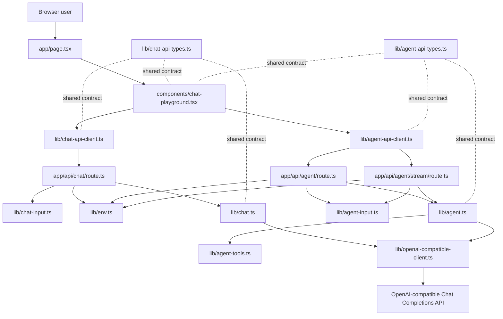
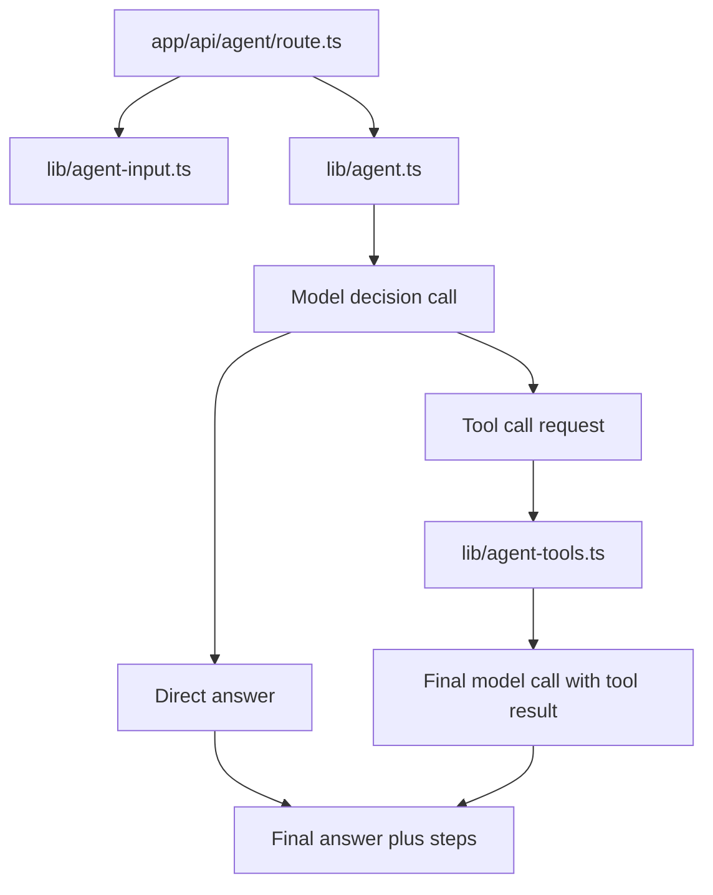

# Architecture

This document is the project map. Keep it current when routes, services,
shared API contracts, environment config, or agent flow boundaries change.

## Current Goal

The project is a small Next.js + TypeScript learning backend. It starts from a
clean OpenAI-compatible chat API call and will grow toward an agent backend.

The code should stay easy to inspect:

- HTTP routes stay thin.
- Request validation stays at the input boundary.
- Business logic receives plain TypeScript objects.
- Shared API types describe the frontend/backend contract.
- Framework-specific objects stay close to the framework boundary.

## Runtime Flow



## Layer Map

```text
app/page.tsx                       Server page shell
components/chat-playground.tsx      React client component and UI state
lib/chat-api-client.ts              Browser-side fetch wrapper
lib/chat-api-types.ts               Shared API request/response types
app/api/chat/route.ts               HTTP entry point for /api/chat
lib/chat-input.ts                   Zod request body parsing and validation
lib/env.ts                          Server-side model configuration
lib/openai-compatible-client.ts     OpenAI SDK client creation
lib/chat.ts                         Chat model service
app/api/agent/route.ts              HTTP entry point for /api/agent
app/api/agent/stream/route.ts       SSE entry point for /api/agent/stream
lib/agent-api-client.ts             Browser-side agent fetch wrapper
lib/agent-api-types.ts              Shared agent API request/response types
lib/agent-input.ts                  Zod agent request body parsing and validation
lib/agent-log.ts                    Structured server log helpers for agent runs
lib/agent-tools.ts                  Local agent tool definitions and execution
lib/agent.ts                        Tool-using agent orchestration service
```

## Boundary Rules

### Frontend

`components/chat-playground.tsx` owns browser interaction state:

- form fields
- selected API mode
- submit state
- success/error display state
- calls to `requestChatCompletion(...)`
- calls to `requestAgentRun(...)`

It should not read `process.env`, create an OpenAI SDK client, or know how the
server talks to the model provider.

### Browser API Client

`lib/chat-api-client.ts` owns the `fetch('/api/chat')` call and response shape
checking.

`lib/agent-api-client.ts` owns the `fetch('/api/agent')` call and response shape
checking.

It also owns the `fetch('/api/agent/stream')` call and SSE parsing for dynamic
agent runs.

These clients should convert unknown JSON into typed API responses before the
React component uses them.

### Route Handler

`app/api/chat/route.ts` owns the HTTP boundary:

- read `NextRequest`
- parse JSON
- call `parseChatInput(...)`
- read model config
- call `callChatModel(...)`
- return `NextResponse.json(...)`

It should stay thin. Do not put model prompts, tool execution, or agent loops
inside route handlers.

`app/api/agent/route.ts` follows the same boundary shape for `/api/agent`:

- read `NextRequest`
- parse JSON
- call `parseAgentInput(...)`
- read model config
- call `runAgent(...)`
- return `NextResponse.json(...)`

`app/api/agent/stream/route.ts` follows the same validation and configuration
boundary, then returns Server-Sent Events:

- `step` events append inspectable agent steps
- `answerDelta` events stream final answer text
- `done` events carry the final `AgentResult`
- `error` events carry stream-time failures

### Input Validation

`lib/chat-input.ts` owns Zod validation for `/api/chat`.

It converts `unknown` request bodies into a stable `ChatInput` business object.

`lib/agent-input.ts` owns Zod validation for `/api/agent`.

It converts `unknown` request bodies into a stable `AgentInput` business object
with `task`, `goal`, `context`, `model`, and `temperature`.

### Service

`lib/chat.ts` owns the model call.

It receives `ChatInput` and `ModelConfig`, creates no HTTP response, and returns
a plain `ChatResult`.

`lib/agent.ts` owns the first agent orchestration path.

It receives `AgentInput` and `ModelConfig`, builds a model prompt, asks the
model whether it needs a local tool, executes requested tools, asks the model
for a final answer when a tool was used, and returns a plain `AgentResult` with
inspectable steps.

`lib/agent-tools.ts` owns local agent tools.

It exposes Chat Completions tool definitions and executes validated local tool
calls. The first tool is `inspect_text`, which returns basic text statistics.

`lib/agent-log.ts` owns structured server logs for `/api/agent`.

Agent logs include a per-request `runId`, event names, full parsed user input,
the assembled model prompt, each step output, final answer, model metadata, and
field lengths. They should not include API keys or other environment secrets.

### Environment

`lib/env.ts` owns server-only environment variables.

Browser files should not import this module.

## Agent Shape

The first agent endpoint uses the same layered shape:

```text
app/api/agent/route.ts              HTTP entry point for /api/agent
app/api/agent/stream/route.ts       SSE entry point for /api/agent/stream
lib/agent-api-types.ts              Shared API request/response types
lib/agent-input.ts                  Zod request body parsing and validation
lib/agent-log.ts                    Structured server log helpers
lib/agent-tools.ts                  Local tool definitions and execution
lib/agent.ts                        Agent orchestration service
```

This version has a small tool loop plus a streaming route. The model can answer
directly, or it can request the local `inspect_text` tool before the final
answer. In the UI, steps arrive as soon as the backend emits them, and final
answer text arrives as `answerDelta` events:



The next agent boundary can add these modules when the runtime needs them:

```text
lib/agent-state.ts                  Agent state/action types
lib/tools/*.ts                      Larger tool families
```

## Maintenance Rule

Update this document in the same change when any of these change:

- a route is added, removed, or renamed
- a `lib/*` module changes responsibility
- a shared API request/response type changes
- an agent loop or tool boundary is added
- frontend data flow changes in a way that affects API calls

For small code edits that do not change module responsibilities, no architecture
update is needed.
