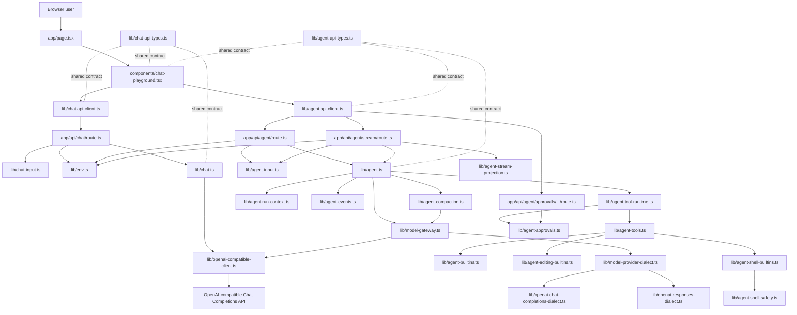
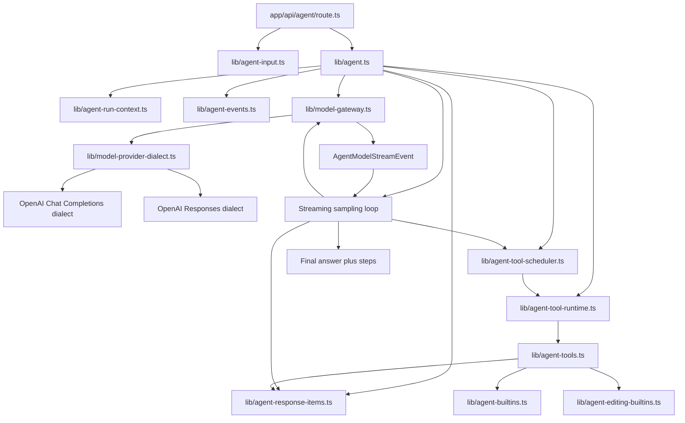
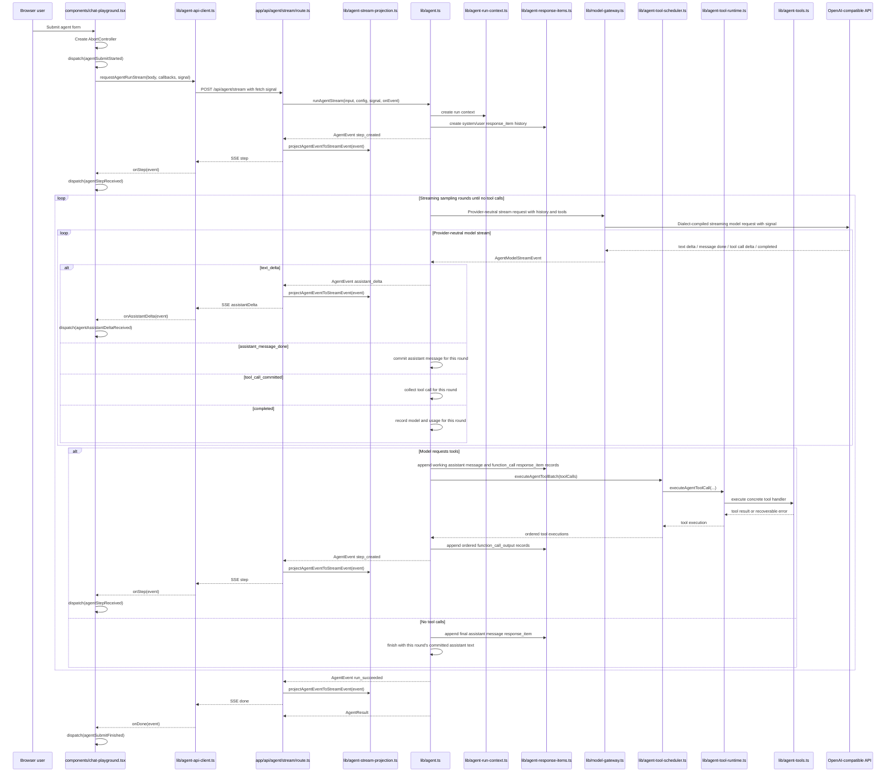

# Architecture

This document is the project map. Keep it current when routes, services,
shared API contracts, environment config, or agent flow boundaries change.

For a chaptered learning path that explains why these layers appeared in this
order, start at `tutorial/README.md`. The English path is
`tutorial/en/README.md`, and the Chinese path is `tutorial/zh/README.md`.

## Current Goal

The project is a small Next.js + TypeScript learning backend. It starts from a
clean OpenAI-compatible chat API call and will grow toward an agent backend.

The code should stay easy to inspect:

- HTTP routes stay thin.
- Request validation stays at the input boundary.
- Business logic receives plain TypeScript objects.
- Shared API types describe the frontend/backend contract.
- Framework-specific objects stay close to the framework boundary.

## Runtime Flow



## Layer Map

```text
app/page.tsx                       Server page shell
components/chat-playground.tsx      React client component and UI state
lib/chat-api-client.ts              Browser-side fetch wrapper
lib/chat-api-types.ts               Shared API request/response types
app/api/chat/route.ts               HTTP entry point for /api/chat
lib/chat-input.ts                   Zod request body parsing and validation
lib/env.ts                          Server-side model configuration
lib/openai-compatible-client.ts     OpenAI SDK client creation
lib/chat.ts                         Chat model service
app/api/agent/route.ts              HTTP entry point for /api/agent
app/api/agent/stream/route.ts       SSE entry point for /api/agent/stream
app/api/agent/sessions/route.ts     HTTP entry point for listing agent sessions
app/api/agent/sessions/[id]/route.ts HTTP entry point for reading one agent session
app/api/agent/approvals/route.ts    HTTP entry point for listing pending approvals
app/api/agent/approvals/[runId]/[toolCallId]/route.ts HTTP entry point for resolving one pending approval
lib/agent-api-client.ts             Browser-side agent fetch wrapper
lib/agent-api-types.ts              Shared agent API request/response types
lib/agent-stream-projection.ts      AgentEvent to SSE API event projection
lib/agent-model-types.ts            Provider-neutral model request/response/event types
lib/agent-model-stages.ts           Shared model-call stage constants
lib/agent-usage.ts                  Token usage normalization and aggregation
lib/agent-input.ts                  Zod agent request body parsing and validation
lib/agent-approval-input.ts         Zod approval decision request body parsing and validation
lib/agent-approvals.ts              In-process pending approval registry and wait/resolve API
lib/agent-permissions.ts            Approval policy, sandbox mode, and permission decisions
lib/agent-run-context.ts            Agent run lifecycle context and cancellation checks
lib/agent-events.ts                 Agent runtime event and run state types
lib/agent-session-store.ts          JSONL session rollout writer and reader
lib/agent-log.ts                    Structured server log helpers for agent runs
lib/agent-tool-contracts.ts         Provider-neutral tool definition and grouping contract
lib/agent-path-policy.ts            Tool path-access policy helpers
lib/agent-tool-runtime.ts           Agent tool execution lifecycle boundary
lib/agent-tools.ts                  Agent tool groups and registry
lib/agent-builtins.ts               Built-in read-only local file tools
lib/agent-editing-builtins.ts       Built-in write/edit local file tools
lib/agent-shell-builtins.ts         Built-in shell tool
lib/agent-shell-safety.ts           Safe-command classifier for the shell tool
lib/agent-response-items.ts         Provider-neutral model-visible history contract
lib/agent-compaction.ts             History compaction decision and full-replacement transform
lib/model-provider-dialect.ts       Provider dialect contract
lib/openai-tool-schema.ts           OpenAI strict tool-schema adapter
lib/openai-chat-completions-dialect.ts OpenAI Chat Completions dialect adapter
lib/openai-responses-dialect.ts     OpenAI Responses dialect adapter
lib/model-gateway.ts                Provider dialect selection and model call boundary
lib/agent.ts                        Tool-using agent orchestration service
```

## Boundary Rules

### Frontend

`components/chat-playground.tsx` owns browser interaction state:

- form fields
- selected API mode
- submit state
- success/error display state
- calls to `requestChatCompletion(...)`
- calls to `requestAgentRunStream(...)`
- reducer actions for streamed agent steps and assistant deltas

It should not read `process.env`, create an OpenAI SDK client, or know how the
server talks to the model provider.

`app/globals.css` owns presentation, including a semantic CSS custom-property
palette on `:root` (`--page-bg`, `--surface`, `--text-strong`, `--accent`,
`--danger`/`--warning`/`--success` groups, and their variants) with dark
equivalents under `@media (prefers-color-scheme: dark)`. There is no manual
theme toggle; the page follows the OS/browser color-scheme preference. A
consolidated dark-mode override block near the end of the file wins over
earlier breakpoint-scoped redefinitions of the same selectors and flattens a
handful of decorative gradients that don't invert cleanly with the variables
alone. See tutorial chapter 22 for the full design and the pitfalls found
while converting the existing hardcoded colors.

### Browser API Client

`lib/chat-api-client.ts` owns the `fetch('/api/chat')` call and response shape
checking.

`lib/agent-api-client.ts` owns the `fetch('/api/agent')` call and response shape
checking.

It also owns the `fetch('/api/agent/stream')` call and SSE parsing for dynamic
agent runs.

These clients should convert unknown JSON into typed API responses before the
React component uses them.

### Route Handler

`app/api/chat/route.ts` owns the HTTP boundary:

- read `NextRequest`
- parse JSON
- call `parseChatInput(...)`
- read model config
- call `callChatModel(...)`
- return `NextResponse.json(...)`

It should stay thin. Do not put model prompts, tool execution, or agent loops
inside route handlers.

`app/api/agent/route.ts` follows the same boundary shape for `/api/agent`:

- read `NextRequest`
- parse JSON
- call `parseAgentInput(...)`
- read model config
- call `runAgent(...)`
- return `NextResponse.json(...)`

`app/api/agent/stream/route.ts` follows the same validation and configuration
boundary, then returns Server-Sent Events:

- `step` events append inspectable agent steps
- `assistantDelta` events stream assistant text; the runtime cannot know whether
  a streamed message is final until the sampling round ends
- `debug` events expose runtime internals for the local Debug Console: model
  requests, model outputs, tool requests, permission decisions, tool starts, and
  tool finishes
- `done` events carry the final `AgentResult`
- `error` events carry stream-time failures

Every run now leaves a terminal event behind: `run_succeeded`, `run_failed`,
or `run_cancelled`. `runAgentStream` emits `run_failed` (projected as the
`error` stream event) or `run_cancelled` (client abort) from its catch path
and persists them to the session JSONL, so the derived run state always
reaches a terminal status. The route only sends a fallback `error` event for
failures that happen before the runtime can emit events, such as resuming an
unknown `sessionId`.

### Input Validation

`lib/chat-input.ts` owns Zod validation for `/api/chat`.

It converts `unknown` request bodies into a stable `ChatInput` business object.

`lib/agent-input.ts` owns Zod validation for `/api/agent`.

It converts `unknown` request bodies into a stable `AgentInput` business object
with `task`, `goal`, `context`, `model`, `temperature`, `approvalPolicy`, and
`sandboxMode`. Omitted policy fields default to
`approvalPolicy=on_request` and `sandboxMode=read_only`.

### Service

`lib/chat.ts` owns the model call.

It receives `ChatInput` and `ModelConfig`, creates no HTTP response, and returns
a plain `ChatResult`.

`lib/agent.ts` owns the first agent orchestration path.

It receives `AgentInput` and `ModelConfig`, builds a model prompt, runs
provider-neutral streaming sampling rounds, executes requested tools, and
returns a plain `AgentResult` with inspectable steps. A round that commits
assistant text and requests no tools is the final answer round. There is no
extra final-answer model call after the tool loop. The service should
coordinate agent steps and lifecycle checks rather than directly create SDK
clients or pass SDK request options.

`lib/agent-run-context.ts` owns per-run lifecycle context.

It currently contains `runId`, `AbortSignal`, and `AgentRunPolicy` plus the
shared cancellation check. Future runtime-level concerns such as trace sinks,
checkpoints, retry budgets, and approval wait state should attach to this
boundary instead of being passed as unrelated optional parameters.

`lib/agent-permissions.ts` owns the approval decision model.

It defines tool annotations, approval policy, sandbox mode, permission requests,
and permission decisions. It does not execute tools and does not enforce OS-level
sandboxing.

`lib/agent-events.ts` owns the first internal agent harness event contract.

`AgentEvent` is the runtime truth for what happened during a run. `AgentStep`
is still the current frontend-friendly display projection. `lib/agent.ts`
emits internal events such as `run_started`, `model_started`,
`model_requested`, `assistant_delta`, `tool_requested`, `tool_started`,
`tool_finished`, `model_completed`, `step_created`, and `run_succeeded`. The
streaming route sends frontend SSE events by projecting these runtime events
through
`lib/agent-stream-projection.ts`.

History commit inspection is intentionally not an `AgentEvent`: the JSONL
session already writes authoritative `response_item` records for resume/replay,
while `debug.historyCommitted` is a stream-only Debug Console event emitted from
the response-item append boundary.

`lib/agent-stream-projection.ts` owns the projection from runtime events to the
browser stream contract:

- `step_created` becomes `step`
- `assistant_delta` becomes `assistantDelta`
- `model_requested` becomes `debug.modelRequested`
- `model_completed` becomes `debug.modelCompleted`
- `tool_requested`, `tool_started`, `tool_permission_decided`, and
  `tool_finished` become `debug` events
- `tool_finished.modelOutput` is the exact text written into
  `function_call_output.output`
- `run_succeeded` becomes `done`
- `run_failed` becomes `error`

`components/chat-playground.tsx` keeps these debug events for the current run
and projects them into a three-zone workbench:

- Left rail: mode switching, current-run status, and a short session list loaded
  from `/api/agent/sessions`.
- Center transcript: the user-facing agent experience. It chains committed
  assistant text with the tool batches requested by the same model output, using
  user-facing labels instead of runtime terms such as "round". Assistant text is
  rendered as Markdown because model output commonly contains lists, code
  blocks, and tables. The legacy `AgentStep` display is still available, but
  collapsed because it is now a display summary rather than the primary runtime
  story.
- Right inspector: Debug, Audit, and Session tabs. Debug shows every model
  request/output, history commit, assistant message, tool call, usage, tool
  argument, model-visible tool output, and internal structured tool detail.
  Audit isolates permission decisions. Session loads persisted JSONL records
  through `/api/agent/sessions/[id]` for resume/replay inspection. The history
  commit layer is where `runtimeRole: "working_message" | "final_response"`
  appears.

The browser is an observer for everything except approval decisions: it does
not execute tools or call the model, but it can approve or deny a suspended
tool call through `POST /api/agent/approvals/{runId}/{toolCallId}`, which
directly unblocks or fails that call inside the runtime.

`tool_permission_decided` records each runtime permission decision.
`approval_requested` records that a tool call needs user approval, and (under
`/api/agent/stream`, which runs with `approvalMode: 'interactive'`) actually
suspends the tool call until the user approves or denies it, or the wait
times out. `approval_resolved` records how it was resolved. See chapter 19 of
the tutorial for the full design.

`lib/agent-model-stages.ts` owns the shared model-call stage names used by
events and usage records. This avoids redefining string stage names separately
in event and response contracts.

`lib/agent-model-types.ts` owns the provider-neutral model IR for the agent
runtime.

This is the anti-corruption layer between the agent loop and provider protocols.
`lib/agent.ts` talks in terms of:

```ts
AgentModelMessage;
AgentModelToolDefinition;
AgentModelToolCall;
AgentModelRequest;
AgentModelStreamEvent;
```

It must not import OpenAI Chat Completions, OpenAI Responses, Anthropic
Messages, or any other provider wire types. This is the same architectural role
that a database query AST plays before a SQL dialect compiles it to one
database's SQL.

Tool definitions in this IR use agent-owned field names:

```ts
type AgentModelToolDefinition = {
  name: string;
  description: string;
  inputSchema: Record<string, unknown>;
  schemaStrict: boolean;
};
```

`inputSchema` is the JSON Schema object that describes tool arguments.
`schemaStrict` is the runtime's strict-schema intent. Provider dialects translate
these fields into provider-specific shapes. OpenAI Chat Completions and OpenAI
Responses compile them to `parameters` and `strict`; a future Anthropic dialect
would compile `inputSchema` to Anthropic's `input_schema` and either ignore or
adapt `schemaStrict`.

OpenAI strict function schemas have a provider-specific rule: every property
must appear in `required`, and optional properties are represented by allowing
`null` in the property type. `lib/openai-tool-schema.ts` performs that
translation inside the OpenAI dialect boundary, so agent-owned schemas can stay
readable and provider-neutral. Runtime Zod parsers normalize those strict-mode
`null` values back to `undefined` for optional fields.

`lib/model-provider-dialect.ts` owns the provider dialect contract.

A dialect is responsible for compiling the agent model IR into one wire API and
parsing provider output back into provider-neutral responses and stream events.
The agent loop consumes the stream event contract for every sampling round:

```ts
type AgentModelStreamEvent =
  | { type: 'text_delta'; delta: string }
  | {
      type: 'assistant_message_done';
      message: {
        text: string;
        providerPhase: 'commentary' | 'final_answer' | null;
      };
    }
  | {
      type: 'tool_call_delta';
      index: number | undefined;
      itemId: string | undefined;
      toolCallId: string | undefined;
      name: string | undefined;
      delta: string;
    }
  | { type: 'tool_call_committed'; toolCall: AgentModelToolCall }
  | { type: 'completed'; model: string; usage: AgentModelUsageSnapshot };
```

`text_delta` is provisional display text. `assistant_message_done` is the commit
point for one assistant message. `tool_call_committed` is the only signal that makes
the agent continue to tools. Provider metadata such as OpenAI Responses
`phase: "commentary" | "final_answer"` is preserved on committed assistant
messages when present, but the core loop does not use it as the stop condition.

The current dialects are:

```text
openai-chat-completions  lib/openai-chat-completions-dialect.ts
openai-responses         lib/openai-responses-dialect.ts
```

Both dialects expose the same capabilities shape:

```ts
type AgentModelCapabilities = {
  tools: boolean;
  streaming: boolean;
  streamingUsage: boolean;
  parallelToolCalls: boolean;
};
```

Provider quirks should stay in dialect files. Runtime code should not branch on
provider-specific fields like `tool_calls`, `function_call_output`,
`response.output_text.delta`, or `stream_options`.

`lib/agent-usage.ts` owns token usage normalization and aggregation.

Single model-call token numbers come from provider dialects. OpenAI Chat
Completions maps `prompt_tokens`, `completion_tokens`, and `total_tokens`.
OpenAI Responses maps `input_tokens`, `output_tokens`, and `total_tokens`. The
agent normalizes those raw values into:

```ts
type AgentTokenUsage = {
  inputTokens: number;
  cachedInputTokens: number | null;
  outputTokens: number;
  reasoningOutputTokens: number;
  totalTokens: number;
};
```

`AgentResult.usage` keeps both the per-call records and the runtime-computed
total:

```ts
type AgentUsage = {
  totalTokenUsage: AgentTokenUsage;
  lastTokenUsage: AgentTokenUsage | null;
  calls: AgentModelCallUsage[];
};
```

`cachedInputTokens` is nullable by design. `0` means the provider explicitly
reported zero cached input tokens. `null` means the provider did not report the
cache-hit field, so the runtime does not know whether cache was used. When
aggregating calls, any unknown cached-token value makes the aggregate
`cachedInputTokens` unknown as well. The runtime only sums calls that include
token usage. Each call still keeps `rawUsage` so provider-specific fields are
not lost.

`lib/agent-session-store.ts` owns JSONL session rollout files.

It writes inspectable append-only session records for streaming agent runs. Each
line is a JSON object with `timestamp`, `type`, and `payload`. The first line is
`session_meta`, the second line is the current `turn_context`, and subsequent
`agent_event` rows mirror runtime events while `response_item` rows persist the
model-visible history emitted by `lib/agent.ts`.

Current files are written under:

```text
data/agent-sessions/YYYY/MM/DD/rollout-{timestamp}-{runId}.jsonl
```

`data/agent-sessions/` is ignored by git because session files can contain user
input, prompts, tool arguments, model output, and other sensitive runtime data.
This module is currently used by `/api/agent/stream`; `/api/agent` still runs
the same model-history loop without persisting a session file.

`app/api/agent/sessions/route.ts` exposes `GET /api/agent/sessions`.

It lists local JSONL sessions and returns summaries such as session id, created
time, updated time, model, wire API, approval policy, sandbox mode, record
count, and relative path. It does not return full records.

`app/api/agent/sessions/[id]/route.ts` exposes `GET /api/agent/sessions/:id`.

It reads one JSONL session by `session_meta.payload.id` and returns the parsed
records. This is an inspect/debug API only. It does not resume a run and does
not reconstruct model-visible history.

For `model_started`, the `stage` field describes why the model call is starting.
The current streaming sampling loop uses `tool_or_answer_selection` because each
round lets the model either answer directly or request tools. `answer_generation`
is kept in the shared enum for earlier session records and future no-tool-only
answer calls, but the current agent runtime no longer performs a separate final
answer model call.

`AgentRunState` is a small derived state object built by applying events in
order. It is not persistent yet. Its purpose is to make future cancellation,
retry, user-input, and resume behavior hang from one runtime model instead of
scattered callbacks. Approval pause/resume (chapter 19) already uses this
event stream; `waiting_for_approval` is a real `AgentRunStatus` value.

`lib/model-gateway.ts` owns model provider calls for agent runs.

It creates the OpenAI SDK client, selects the configured dialect from
`OPENAI_WIRE_API`, applies the configured model, forwards the agent run
`AbortSignal`, and exposes narrow provider-neutral `createResponse` and
`streamResponse` methods. This module should remain a gateway and registry
boundary. Protocol details belong in dialect files.

`lib/agent-tool-runtime.ts` owns the tool execution lifecycle.

It receives model tool calls, checks run cancellation, looks up tools by name in
the registry, asks the permission runtime for a decision, emits tool runtime
events, executes concrete tool handlers, and returns tool execution results.
This keeps `lib/agent.ts` focused on orchestration instead of tool lifecycle
details. It also owns the model-facing tool output serialization boundary:
internal tool output is structured, but `function_call_output.output` is plain
text. When a decision is `ask` and `context.approvalMode === 'interactive'`,
the runtime suspends on `lib/agent-approvals.ts` until the user approves,
denies, or the wait times out or the run aborts (see chapter 19). Later
versions can add richer output validation at this boundary and an "approved
for session" shortcut.

Tool output uses three internal variants:

```ts
type AgentToolOutput =
  | {
      type: 'success';
      contentText: string;
      details?: unknown;
      notice?: string;
      truncated?: boolean;
    }
  | {
      type: 'respond_to_model';
      error: { code: AgentToolErrorCode; message: string };
      details?: unknown;
    }
  | {
      type: 'fatal';
      error: { code: AgentToolErrorCode; message: string };
      details?: unknown;
    };
```

`success` and `respond_to_model` become ordered `function_call_output` records.
`fatal` terminates the run and is not serialized as an ordinary tool result.
Runtime timeout and in-flight abort become `respond_to_model` outputs with
stable error codes. This mirrors the useful split from Codex and pi-mono:
structured metadata remains internal, while the model sees low-friction text.

`lib/agent-tool-contracts.ts` owns the provider-neutral internal tool contract.
The contract separates runtime metadata from provider-visible schema:

```text
source        builtin | dynamic | mcp | hosted
group         utility_builtins | read_only_builtins | editing_builtins | shell_builtins
category      utility | read | search | write | shell
annotations   readOnly / destructive / openWorld / idempotent facts
execution     executionMode, timeoutMs, abortable
pathAccess    none | current_project | allowed_roots | danger_full_access
modelTool     name, description, inputSchema, schemaStrict
execute       concrete handler
```

`lib/agent-tools.ts` owns the active tool groups and registry. Current active
groups are:

```text
utility_builtins    empty skeleton
read_only_builtins  read, grep, find, ls
editing_builtins    write, edit
shell_builtins      shell
```

Dialects only receive `modelTool`. Internal metadata such as `source`, `group`,
`pathAccess`, `annotations`, and `executionMode` stays inside the agent runtime
and is available to permission decisions, scheduler decisions, debug events,
and future telemetry.

`lib/agent-builtins.ts` owns the concrete built-in read-only tools:

```text
ls      list local directory entries
find    find files by glob-style path pattern
grep    search file contents with ripgrep
read    read UTF-8 text files with line pagination
```

These tools are read-only, non-destructive, closed-world, idempotent, marked
parallel-capable, and attached to `pathAccess=current_project`.

`lib/agent-editing-builtins.ts` owns the concrete built-in editing tools:

```text
write   create or overwrite a UTF-8 text file and return a focused diff
edit    apply exact replacements to an existing UTF-8 text file and return a focused diff
```

These tools are destructive, closed-world, sequential, and attached to
`pathAccess=current_project`. `write` can create parent directories under the
effective path policy. `edit` is intentionally stricter: the same run must have
successfully used `read` on the target path before `edit` can execute. If that
precondition is missing, the runtime returns
`Error [EDIT_REQUIRES_READ]: ...` as a recoverable tool output and lets the
model retry by reading first.

`lib/agent-shell-builtins.ts` owns the concrete built-in shell tool:

```text
shell   run a command with bash -c, per-call timeout, and truncated output
```

The shell tool is destructive, open-world, sequential, and attached to
`pathAccess=current_project` through its optional `workdir` argument. It layers
two timeouts: the definition-level `timeoutMs=60000` is the hard runtime
ceiling, while the model-supplied `timeoutMs` (default 10000) is a per-call
soft timeout that kills the child process. stdout and stderr are collected per
stream and truncated at 10240 chars / 256 lines. Non-zero exit codes return as
normal success output because a failing command is information the model needs.

`lib/agent-shell-safety.ts` owns the safe-command classifier. It answers one
question: does this command match a known read-only pattern? Shell control
constructs (`;`, `&&`, `>`, `$`, backticks, ...) are never analyzed and fall
back to review. Pipelines are safe only when every segment is safe. The
classifier prefers false negatives over false positives.

A command name alone is not enough for a safe verdict; arguments are screened
too, because safe commands skip approval entirely:

- Path escapes: any argument (or `--flag=value` value) that is an absolute
  path, starts with `~`, or contains a `..` path segment falls back to review.
  `cat /etc/passwd` is not a read-only pattern even though `cat` is.
- Write/exec-capable flags per command: `sort`/`tree` reject `-o`/`--output`
  prefixes, `rg` rejects `--pre`/`--hostname-bin`, `uniq` allows at most one
  positional argument (a second one is an output file).
- `git` rejects global flags before the subcommand (`-C`, `-c`, `--git-dir`,
  `--exec-path` can retarget the repository or executed programs) and
  `--output` after it; `find` keeps its action-flag denylist.

This is still a lexical screen, not a sandbox: it cannot see through symlinks
or know what a command actually touches at runtime. The shell tool also spawns
its child process with an allowlisted environment (`PATH`, `HOME`, locale
variables, ...) instead of the full `process.env`, so an approved `env` or
`printenv` cannot leak `OPENAI_API_KEY` into model-visible output, and the
`workdir` argument goes through the same realpath-then-recheck sequence as the
file builtins to block symlinked workdir escapes.

The shell tool plugs into permissions through the optional `decidePermission`
hook on the tool contract. The runtime composition rule lives in
`agent-tool-runtime.ts`: the generic permission decision runs first, a generic
deny is final, and the tool override can only refine allow/ask decisions
(decision source `tool_override`). For shell: safe commands allow in every
sandbox mode, unsafe commands deny in `read_only`, and unsafe commands in
write modes fall back to the run approval policy.

`lib/agent-tools.ts` derives provider-visible tools from the current
`AgentRunPolicy`:

```text
sandboxMode=read_only          read, grep, find, ls, shell (safe commands only)
sandboxMode=workspace_write    read, grep, find, ls, write, edit, shell
sandboxMode=danger_full_access read, grep, find, ls, write, edit, shell
```

`lib/agent-path-policy.ts` owns path policy resolution. The current built-ins
use `current_project`, so each path is resolved against the current project
root and then checked with `realpath`; `../` paths and symlink escapes fail as
ordinary tool errors. The module also defines `allowed_roots` and
`danger_full_access` for tools that need wider roots, such as shell in
danger-full-access runs.

Large outputs return bounded structured data plus actionable notices, such as
using a later `offset` for `read` or narrowing a `grep` pattern.

`lib/agent-log.ts` owns structured server logs for `/api/agent`.

Agent logs include a per-request `runId`, event names, full parsed user input,
the assembled model prompt, each step output, final answer, model metadata, and
field lengths. They should not include API keys or other environment secrets.

### Environment

`lib/env.ts` owns server-only environment variables.

Browser files should not import this module.

Current model-related variables are:

```text
OPENAI_API_KEY
OPENAI_BASE_URL
OPENAI_MODEL
OPENAI_WIRE_API=openai-chat-completions | openai-responses
```

## Agent Shape

The first agent endpoint uses the same layered shape:

```text
app/api/agent/route.ts              HTTP entry point for /api/agent
app/api/agent/stream/route.ts       SSE entry point for /api/agent/stream
app/api/agent/sessions/route.ts     HTTP entry point for listing agent sessions
app/api/agent/sessions/[id]/route.ts HTTP entry point for reading one agent session
lib/agent-api-types.ts              Shared API request/response types
lib/agent-stream-projection.ts      AgentEvent to SSE API event projection
lib/agent-model-types.ts            Provider-neutral model request/response/event types
lib/agent-model-stages.ts           Shared model-call stage constants
lib/agent-usage.ts                  Token usage normalization and aggregation
lib/agent-input.ts                  Zod request body parsing and validation
lib/agent-permissions.ts            Approval and sandbox policy decisions
lib/agent-run-context.ts            Per-run lifecycle context and cancellation
lib/agent-events.ts                 Internal runtime events and derived run state
lib/agent-session-store.ts          JSONL session rollout writer and reader
lib/agent-log.ts                    Structured server log helpers
lib/agent-tool-contracts.ts         Provider-neutral tool contract, source, groups, execution metadata
lib/agent-path-policy.ts            current-project / allowed-roots / danger-full-access path policy
lib/agent-tool-runtime.ts           Tool execution lifecycle boundary
lib/agent-tools.ts                  Tool groups and registry
lib/agent-builtins.ts               Built-in read-only local file tools
lib/agent-editing-builtins.ts       Built-in write/edit local file tools
lib/model-provider-dialect.ts       Provider dialect contract
lib/openai-chat-completions-dialect.ts OpenAI Chat Completions dialect adapter
lib/openai-responses-dialect.ts     OpenAI Responses dialect adapter
lib/model-gateway.ts                Provider dialect selection and model call boundary
lib/agent.ts                        Agent orchestration service
```

This version has the first streaming agent sampling loop with assistant message
commit semantics. The model-visible history is represented by provider-neutral
`AgentResponseItem` records. Every model sampling round uses `streamResponse`,
so the runtime can receive provisional assistant text deltas, assistant message
commit events, tool-call argument deltas, completed tool calls, and final usage
through one provider-neutral stream. If a completed round contains tool calls,
the runtime records any committed assistant messages as working messages,
records the function calls, executes the tool batch, records function-call
outputs, and continues. If a completed round contains no tool calls, the
committed assistant message text is the final answer. There is no extra
final-answer model call.



`AgentResponseItem` currently has three variants:

```ts
type AgentResponseItem =
  | {
      type: 'message';
      role: 'system' | 'user' | 'assistant';
      content: string;
      providerPhase?: 'commentary' | 'final_answer' | null;
      runtimeRole?: 'working_message' | 'final_response';
    }
  | {
      type: 'function_call';
      callId: string;
      name: string;
      argumentsJson: string;
    }
  | {
      type: 'function_call_output';
      callId: string;
      toolName: string;
      output: string;
      isError: boolean;
    };
```

`lib/agent-response-items.ts` converts this history into
`AgentModelMessage[]` before handing it to the selected provider dialect.
Provider wire details remain inside the dialect files. `providerPhase` is
provider metadata that may be useful for Responses-compatible models. It is not
the agent loop stop condition. `runtimeRole` records how the agent loop
classified a committed assistant message after the sampling round completed.

Tool batching is handled by `lib/agent-tool-scheduler.ts`:

```text
all tool calls in batch have executionMode="parallel" -> run with Promise.all
otherwise                                           -> run sequentially
```

Even when tools run in parallel, `function_call_output` records are appended in
the model's original tool-call order. Runtime events may reflect real completion
order; model history stays deterministic.

Data dependency is not inferred by the runtime. If one tool needs another
tool's output, the model should request the second tool in a later round after
the first `function_call_output` is present in history. The scheduler only
decides whether a single already-emitted batch is safe to run concurrently based
on explicit tool metadata.

Ordinary tool errors such as unknown tool names, invalid arguments, path errors,
timeouts, in-flight aborts, or handler exceptions become plain-text
`function_call_output` records. The model sees text such as
`Error [PATH_NOT_FOUND]: ...`, not an `ok/error` JSON envelope. That keeps the
model loop recoverable while preserving structured `details` in runtime events
and steps. Denied policy decisions always return a recoverable
`function_call_output`. Permission pauses (`ask`) resume interactively under
`approvalMode: 'interactive'` (chapter 19); a denial there also returns a
recoverable `Error [APPROVAL_DENIED]: ...` output instead of throwing. Other
contexts (`approvalMode: 'fail_closed'`, the default) still fail closed by
throwing `AgentApprovalRequiredError`.

The first production-shaped tool foundation was read-only local file
exploration; editing and shell layered on top of the same boundaries later. The
current tool set:

```text
read(path, offset?, limit?)
grep(pattern, path?, glob?, ignoreCase?, literal?, limit?)
find(pattern, path?, limit?)
ls(path?, limit?)
write(path, content)
edit(path, edits[])
shell(command, workdir?, timeoutMs?)
```

All of them exercise the same provider-neutral function-call path that future
MCP and hosted tools will use. `grep` depends on local `rg` and reports a
model-visible tool error if it is unavailable.

Each tool formats its own model-facing `contentText` because each tool knows its
best readable shape. The runtime centrally appends optional notices and formats
recoverable errors. Tool `details` keep structured data such as paths, line
numbers, truncation flags, and match arrays for logs/UI/debugging.

## Streaming UI Flow

The streaming path keeps the agent runtime on the server and uses React as an
observer of the run. The browser does not execute tools or call the model,
though it can approve or deny a suspended tool call (see "Approval Pause
Semantics" below).



State ownership in the React component is intentionally narrow:

- `agentSubmitStarted` switches `agentView` to `streaming` and clears old output.
- `agentStepReceived` appends one `AgentStep` to `agentView.steps`.
- `agentAssistantDeltaReceived` appends text to `agentView.answer`.
- `agentRunAborted` preserves already received steps and answer text, then marks
  the run as `aborted`.
- `agentSubmitFinished` replaces the temporary streaming state with the final
  `AgentResult`.

Cancellation uses the platform abort chain rather than a model instruction:

- `components/chat-playground.tsx` owns an `AbortController` for the current
  agent run.
- `lib/agent-api-client.ts` passes the `AbortSignal` to `fetch(...)`.
- `app/api/agent/stream/route.ts` reads `request.signal` and passes it into the
  agent service.
- `lib/agent-run-context.ts` makes the signal part of the agent run lifecycle.
- `lib/model-gateway.ts` passes the same signal into OpenAI SDK request options
  and guards streamed chunks.
- `lib/agent.ts` checks the run context between agent stages such as prompt
  construction and tool execution.

Typing a new "stop" instruction into the model is not a true cancellation of the
in-flight request. It is just another future request. The real interruption path
is aborting the current HTTP/model request.

## Permission And Sandbox Design

The permission model follows the Codex-style separation between tool facts,
approval policy, and sandbox boundaries.

```text
Tool annotations     What the tool says about its behavior
Approval policy      Whether this run should auto-allow, ask, or deny
Sandbox mode         What the execution environment can actually touch
Hooks / guardian     Future dynamic policy layers
User approval        Interactive final decision under approvalMode: 'interactive' (chapter 19)
```

These layers must stay separate. A tool does not decide whether it may run. A
tool only declares behavior hints. The runtime decides whether the current call
is allowed under the current run policy. The sandbox, once implemented, enforces
hard execution boundaries even after approval.

Tool annotations are multi-dimensional facts, not a single risk level:

```ts
type AgentToolAnnotations = {
  readOnly?: boolean;
  destructive?: boolean;
  openWorld?: boolean;
  idempotent?: boolean;
};
```

`undefined` means unknown, not false. Unknown hints are treated conservatively.
The current active built-in read-only tools declare `readOnly=true`,
`destructive=false`, `openWorld=false`, and `idempotent=true`.

Approval policy is run-level configuration:

```text
strict      Only known-safe tools are auto-approved.
on_request  Default. Known-safe tools are auto-approved; unknown/risky tools ask.
never       Never ask for interactive approval. This is not the same as sandbox bypass.
```

Sandbox mode is also run-level configuration:

```text
read_only
workspace_write
danger_full_access
```

Current implementation status:

- `AgentRunPolicy` exists on `AgentRunContext`.
- The default is `approvalPolicy=on_request` and `sandboxMode=read_only`.
- `/api/agent` and `/api/agent/stream` accept `approvalPolicy` and
  `sandboxMode` in the validated request body, and the React workbench exposes
  them as Agent form controls.
- `AgentToolRuntime` creates an `AgentPermissionRequest` before executing a
  tool.
- The request includes declared tool metadata, the effective path policy for
  the current sandbox mode, and any model-supplied path argument that the tool
  declares as permission-relevant.
- The request also includes tool-state preconditions, such as whether the
  current run has already successfully read the target path.
- `decideAgentToolPermission(...)` checks path policy before approval policy,
  so `approvalPolicy=never` cannot bypass filesystem boundaries.
- `edit` checks the read-before-edit precondition before execution and is
  recoverably denied with `EDIT_REQUIRES_READ` when the target has not been
  read.
- Known-safe tools are allowed.
- Write-capable built-ins are denied under `sandboxMode=read_only`, allowed
  under `workspace_write` after path/precondition checks, and ask under
  `approvalPolicy=strict`.
- Project-outside paths are denied before tool execution and returned to the
  model as recoverable tool errors.
- Unknown, destructive, or open-world tools ask for approval.
- Interactive approval resume exists (chapter 19): under
  `approvalMode: 'interactive'` (set by `/api/agent/stream`), an `ask`
  decision emits `approval_requested`, suspends on `lib/agent-approvals.ts`,
  and resumes after `POST /api/agent/approvals/{runId}/{toolCallId}` approves
  or denies it, or after a timeout/abort denies it. Contexts without
  `approvalMode: 'interactive'` (the default, used by the non-streaming
  `/api/agent` route) still raise `AgentApprovalRequiredError` as a
  fail-closed placeholder, since there is no push channel to surface the
  request to a user.
- Sandbox mode is not an OS sandbox yet, but it now determines both the
  effective path access policy and the provider-visible built-in tool surface.
  `danger_full_access` widens path-declaring tools to absolute filesystem
  access, while `read_only` and `workspace_write` keep the current project
  boundary for built-in file tools.

`danger_full_access` is a path/sandbox policy mode, not a fact that a tool can
claim for itself. It should be selected by the user, app, or run configuration,
then passed into the runtime policy layer. It must not be inferred from the
model or from a tool call.

Future decision order should be:

```text
tool-level/user config override
  -> hook/rule engine
  -> global approval policy + tool annotations
  -> guardian/classifier if added
  -> user approval if interactive
  -> sandbox enforcement at execution time
```

Every decision remains auditable through event logs. Decisions use
`tool_permission_decided`; interactive pauses use `approval_requested` and
`approval_resolved`, both of which are persisted to the session JSONL like any
other agent event. `AgentApprovalRequiredError` remains the fail-closed
placeholder for contexts without an interactive approval channel (see below).

Path denials are not approval pauses. They are terminal for that tool call but
recoverable for the agent loop: the runtime emits `tool_permission_decided`
with `decision.type="deny"`, skips `tool_started`, writes a model-visible tool
error such as `Error [PATH_OUTSIDE_ALLOWED_ROOT]: ...`, and lets the model
continue from that observation.

### Approval Pause Semantics

`tool_permission_decided` and `approval_requested` are intentionally separate.

`tool_permission_decided` is an audit event. It records the decision made by the
permission runtime:

```text
allow  The tool call may continue.
ask    The tool call needs approval before execution.
deny   The tool call is rejected by policy.
```

This event does not by itself move the run into a waiting state. It records what
the policy decided.

`approval_requested` is a workflow event. It means the run has reached a point
where tool execution cannot continue without an external approval response. This
event moves `AgentRunState.status` to `waiting_for_approval`.

Under `approvalMode: 'interactive'` (see `lib/agent-run-context.ts`), an `ask`
decision follows a real pause/resume protocol instead of failing closed:

```text
tool_permission_decided(ask)
approval_requested                 -- projected as a first-class `approvalRequired` SSE event
suspend on lib/agent-approvals.ts (in-process pending map, keyed by runId:toolCallId)
POST /api/agent/approvals/{runId}/{toolCallId} { decision } resolves it
  (or a 120s timeout, or the run's AbortSignal, resolves it as denied)
approval_resolved                  -- projected as a first-class `approvalResolved` SSE event
approved -> tool executes normally
denied   -> recoverable `Error [APPROVAL_DENIED]: ...` function_call_output, loop continues
```

Contexts without `approvalMode: 'interactive'` (the default) keep the original
fail-closed sequence, because there is no channel to deliver the approval
request to a user:

```text
tool_permission_decided(ask)
approval_requested
throw AgentApprovalRequiredError
```

Pending approval state lives in process memory only (a `Map` stashed on
`globalThis` so it survives Next.js's route-level module instancing) and is
not persisted to JSONL. A process restart is equivalent to a denial for any
approval that was in flight — the same behavior Codex and Claude Code use.
The full audit trail still exists, because `approval_requested` and
`approval_resolved` are ordinary agent events written to the session JSONL.
See tutorial chapter 19 for the full design and its tradeoffs, including what
persisting pending state across restarts would require.

`AgentPermissionDeniedError` is different. A `deny` decision is terminal for the
current tool call and may fail the run immediately unless a future policy layer
chooses to feed the denial back to the model as a recoverable tool result.

## Session Rollout Design

The session store follows the Codex-style rollout idea in a smaller form. Codex
stores a full session as JSONL with tagged rows such as `session_meta`,
`response_item`, `event_msg`, `turn_context`, and `compacted`. This project now
persists both runtime events and provider-neutral model-visible history.

Current row shape:

```ts
type AgentSessionRecord =
  | { timestamp: string; type: 'session_meta'; payload: AgentSessionMeta }
  | { timestamp: string; type: 'turn_context'; payload: AgentTurnContext }
  | { timestamp: string; type: 'agent_event'; payload: AgentEvent }
  | { timestamp: string; type: 'response_item'; payload: AgentResponseItem };
```

Example file:

```text
{"timestamp":"...","type":"session_meta","payload":{"id":"...","cwd":"...","source":"api_agent_stream",...}}
{"timestamp":"...","type":"turn_context","payload":{"turnId":"...","model":"...","wireApi":"openai-chat-completions","approvalPolicy":"on_request","sandboxMode":"read_only"}}
{"timestamp":"...","type":"response_item","payload":{"type":"message","role":"system","content":"..."}}
{"timestamp":"...","type":"response_item","payload":{"type":"message","role":"user","content":"..."}}
{"timestamp":"...","type":"agent_event","payload":{"type":"run_started","runId":"..."}}
{"timestamp":"...","type":"agent_event","payload":{"type":"step_created","step":{...}}}
{"timestamp":"...","type":"response_item","payload":{"type":"function_call","callId":"...","name":"read","argumentsJson":"..."}}
{"timestamp":"...","type":"response_item","payload":{"type":"function_call_output","callId":"...","toolName":"read","output":"File: ...","isError":false}}
{"timestamp":"...","type":"agent_event","payload":{"type":"run_succeeded","result":{"usage":{"totalTokenUsage":{...},"lastTokenUsage":{...},"calls":[...]}}}}
```

Current guarantees:

- records are append-only
- every append writes one JSONL line
- writes are synchronous in the current request so write failures fail fast
- session files survive process restart
- session files are not committed to git
- local API clients can list sessions and read full records by id
- final results include normalized per-call token usage and summed token usage
- streaming agent runs persist `response_item` rows for system/user messages,
  function calls, function-call outputs, and final assistant messages

Session resume now exists (chapter 20). `AgentInput.sessionId` decouples
session identity (stable across turns) from `context.runId` (fresh per turn).
`lib/agent-session-store.ts` owns two additional functions:

```text
normalizeAgentResponseItemHistory(items)
  ensures every function_call has a matching function_call_output; a crash
  between committing a tool call and its output leaves an orphan, so this
  inserts a synthesized function_call_output (isError: true, reusing the
  original callId) after any orphan function_call

replayAgentResponseItemHistory(items)
  rebuilds the model-visible history by replaying items in write order; a
  compaction_summary row marks a point where the live run replaced its
  history, and because applyAgentHistoryCompaction is a pure function of
  (history so far, summary text), replaying it reconstructs exactly the
  compacted history the live run continued with

resumeAgentSession(sessionId)
  finds the session file, reads every response_item record in write order,
  replays compactions with replayAgentResponseItemHistory, runs
  normalizeAgentResponseItemHistory, and returns the reconstructed
  history plus the session handle -- without writing a new session_meta record
```

`lib/agent.ts`'s `initializeAgentSessionForStream` (exported for tests) is
the single place that decides fresh-session vs. resumed-session behavior. It
returns both the full `history` sent to the model and a separate
`newItemsToPersist`: for a fresh session these are the same two items
(system + user); for a resumed session, `newItemsToPersist` is only the
normalization's synthesized outputs plus the new user message. The full
reconstructed history is never re-appended to the file, so resuming a session
repeatedly does not make the JSONL file grow superlinearly. Resuming an
unknown `sessionId` throws rather than silently starting a new session, so
the failure surfaces as an SSE `error` event instead of a silent new
conversation.

Context compaction now exists (chapter 21). `lib/agent-compaction.ts` owns
the pure decision/transform functions:

```text
decideAgentHistoryCompaction(tokenUsage, history, threshold)
  returns shouldCompact: false when tokenUsage is null (the provider didn't
  report usage), when totalTokens is below the threshold, or when history is
  too short to be worth compacting; otherwise returns the reason and the
  triggering tokenUsage

buildCompactionSummaryRequest(history)
  a tools:[] / toolChoice:'none' AgentModelRequest asking the model for a
  concise summary of the transcript so far

applyAgentHistoryCompaction(history, summaryText)
  full replacement: keeps the leading system message (if any) and recent
  user messages (reverse-filled, budgeted at 20000 chars), drops every
  assistant/function_call/function_call_output item, and inserts one new
  compaction_summary item -- because no tool call ever survives partially,
  the function_call/function_call_output pairing invariant holds without a
  separate normalization pass
```

`lib/agent.ts`'s `compactAgentHistoryIfNeeded` calls
`modelGateway.createResponse(...)` (the non-streaming method on
`AgentModelGateway`, previously unused by the sampling loop) and runs
between sampling rounds -- after a round's tool outputs are fully committed,
before the next round's model request -- so compaction never tears apart an
in-flight tool call. Only the new `compaction_summary` response item is
written back to JSONL; the discarded items were already persisted when
originally committed, so the file remains append-only and does not shrink.
`AgentResponseItem` gained the `compaction_summary` variant, and a
`history_compacted` event (projected as the debug event `historyCompacted`)
records the reason, token usage, and removed/kept item counts for the Debug
Console.

There is no dedicated `compacted` JSONL row type distinct from ordinary
`response_item`/`agent_event` records -- compaction is fully observable
through the existing record kinds, so a bespoke third type wasn't needed.
The `compaction_summary` row doubles as the replay marker: resume applies the
same pure transform at that point instead of returning the uncompacted
transcript, so compaction survives session resume.

Current limitations:

- resume only exists for the streaming route; the non-streaming `/api/agent`
  route has no session concept and never persists
- the compaction token threshold is a fixed constant
  (`DEFAULT_COMPACTION_TOKEN_THRESHOLD`), not configured per model's real
  context window, since `ModelConfig` doesn't track that metadata
- no Claude Code-style microcompact that evicts stale tool output without a
  model call; every compaction here costs one extra model call
- no retry or circuit breaker if the summarization call fails -- the run
  just fails
- no way to fork a new session from a point in history (Codex's `fork`)
- approval pause/resume (chapter 19) works within a live run, but pending
  approval state is process memory only and is not persisted to JSONL, so it
  cannot survive a process restart or be recovered by a resume API
- session read/list APIs are for local inspection and debugging

Future session work should add:

```text
event_msg          UI/internal events that are not model-visible
session fork        branch a new session from a point in an existing session's history
durable approvals   persist pending approval state so it survives a restart
per-model limits    configure the compaction threshold from real context-window sizes
```

The next agent boundary can add these modules when the runtime needs them:

```text
lib/tools/*.ts                      Larger tool families
```

`lib/agent-tool-runtime.ts` now exists as the first tool lifecycle boundary.
`lib/agent-tool-contracts.ts` and `lib/agent-tools.ts` now contain the local
tool contract, grouping, and registry:

```text
tool source/group -> tool name -> annotations/path/execution policy
                  -> provider-neutral input schema -> handler -> output schema
```

The current registry includes the name, source, group, category, annotations,
path access, execution metadata, provider-neutral `inputSchema`, runtime input
parsing, and handler. Handlers return structured `AgentToolOutput` values with
model-facing `contentText` and internal `details`. Output schema is the next
part to add when the tool boundary needs stricter typed contracts.

## Agent Harness Direction

The long-term target is an agent runtime/harness, not only a single service that
calls a model. In this project, harness means the backend layer around the model
that controls:

- task and context assembly
- model-provider calls
- tool registration and execution
- cancellation and retry boundaries
- permission and approval pauses
- user input during a run
- append-only run events
- derived run state
- logs, traceability, and future replay/evaluation

The model remains one component inside the harness. The harness owns the loop:

```text
user task -> runtime event -> model call -> tool request -> tool execution
          -> runtime event -> final answer or next loop
```

The current implementation is intentionally small:

- `AgentEvent` is the internal runtime event contract.
- `AgentRunState` is derived from events.
- `AgentResponseItem` is the provider-neutral model-visible history contract.
- `AgentToolScheduler` chooses sequential or opt-in parallel execution for a
  batch of tool calls.
- `AgentToolRuntime` wraps concrete tool execution and emits tool lifecycle
  events.
- `Agent` does not cap the total number of sampling rounds. It relies on user
  abort, per-tool timeouts, and a repeated-tool-call guard that stops identical
  tool name + arguments + output loops after three repeats.
- `AgentPermissions` makes annotation-based approval decisions before tool
  execution; `ask` decisions pause and resume interactively through
  `AgentApprovals` when `approvalMode: 'interactive'` is set (chapter 19).
- `AgentStreamProjection` maps runtime events to the current frontend SSE
  contract.
- The frontend splits the same stream into a left session rail, center
  transcript, and right inspector. The transcript groups same-round tool calls
  into collapsible batches without showing runtime round labels; the Debug tab
  keeps complete scrollable JSON/text payloads for model requests, model
  outputs, tool lifecycle, tool `modelOutput`, and final usage; the Audit tab
  isolates permission decisions; the Session tab loads the run's persisted
  JSONL records through the session read API.
- `AgentSessionStore` persists streaming run metadata, turn context, runtime
  events, and model-visible `response_item` records as JSONL.
- Existing `AgentStep` objects remain the frontend display contract.

Future work should grow the harness in this order:

1. enforce OS-level sandboxing under the existing path/permission boundaries
2. add richer tools and MCP-style external tool registration
3. configure the compaction threshold and other run limits per model

Already done: interactive approval pause/resume (chapter 19), a shell tool
behind a safe-command classifier (chapter 18), session replay/resume for
multi-turn conversations (chapter 20), and context compaction (chapter 21).

## Maintenance Rule

Update this document in the same change when any of these change:

- a route is added, removed, or renamed
- a `lib/*` module changes responsibility
- a shared API request/response type changes
- an agent loop or tool boundary is added
- frontend data flow changes in a way that affects API calls

For small code edits that do not change module responsibilities, no architecture
update is needed.
