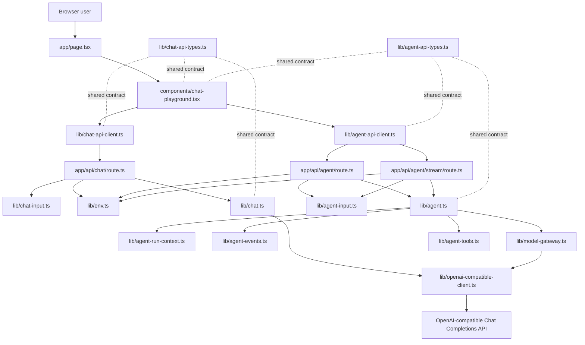
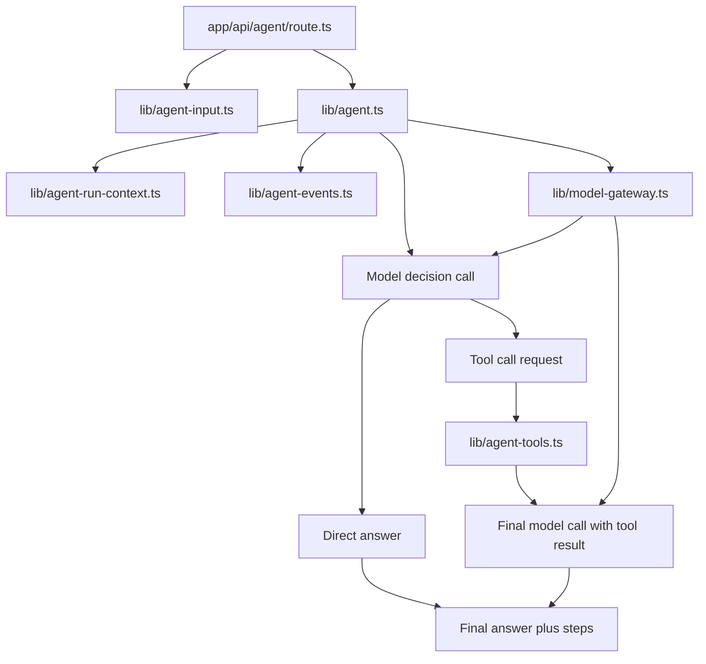
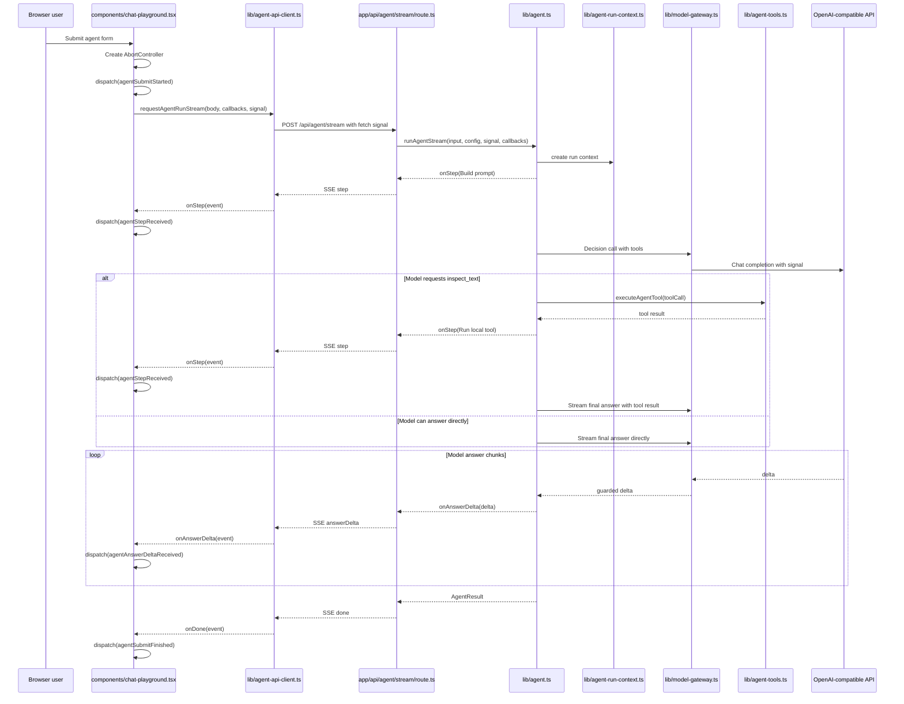

# Architecture

This document is the project map. Keep it current when routes, services,
shared API contracts, environment config, or agent flow boundaries change.

## Current Goal

The project is a small Next.js + TypeScript learning backend. It starts from a
clean OpenAI-compatible chat API call and will grow toward an agent backend.

The code should stay easy to inspect:

- HTTP routes stay thin.
- Request validation stays at the input boundary.
- Business logic receives plain TypeScript objects.
- Shared API types describe the frontend/backend contract.
- Framework-specific objects stay close to the framework boundary.

## Runtime Flow



## Layer Map

```text
app/page.tsx                       Server page shell
components/chat-playground.tsx      React client component and UI state
lib/chat-api-client.ts              Browser-side fetch wrapper
lib/chat-api-types.ts               Shared API request/response types
app/api/chat/route.ts               HTTP entry point for /api/chat
lib/chat-input.ts                   Zod request body parsing and validation
lib/env.ts                          Server-side model configuration
lib/openai-compatible-client.ts     OpenAI SDK client creation
lib/chat.ts                         Chat model service
app/api/agent/route.ts              HTTP entry point for /api/agent
app/api/agent/stream/route.ts       SSE entry point for /api/agent/stream
lib/agent-api-client.ts             Browser-side agent fetch wrapper
lib/agent-api-types.ts              Shared agent API request/response types
lib/agent-input.ts                  Zod agent request body parsing and validation
lib/agent-run-context.ts            Agent run lifecycle context and cancellation checks
lib/agent-events.ts                 Agent runtime event and run state types
lib/agent-log.ts                    Structured server log helpers for agent runs
lib/agent-tools.ts                  Local agent tool definitions and execution
lib/model-gateway.ts                Model provider call boundary for agent runs
lib/agent.ts                        Tool-using agent orchestration service
```

## Boundary Rules

### Frontend

`components/chat-playground.tsx` owns browser interaction state:

- form fields
- selected API mode
- submit state
- success/error display state
- calls to `requestChatCompletion(...)`
- calls to `requestAgentRunStream(...)`
- reducer actions for streamed agent steps and answer deltas

It should not read `process.env`, create an OpenAI SDK client, or know how the
server talks to the model provider.

### Browser API Client

`lib/chat-api-client.ts` owns the `fetch('/api/chat')` call and response shape
checking.

`lib/agent-api-client.ts` owns the `fetch('/api/agent')` call and response shape
checking.

It also owns the `fetch('/api/agent/stream')` call and SSE parsing for dynamic
agent runs.

These clients should convert unknown JSON into typed API responses before the
React component uses them.

### Route Handler

`app/api/chat/route.ts` owns the HTTP boundary:

- read `NextRequest`
- parse JSON
- call `parseChatInput(...)`
- read model config
- call `callChatModel(...)`
- return `NextResponse.json(...)`

It should stay thin. Do not put model prompts, tool execution, or agent loops
inside route handlers.

`app/api/agent/route.ts` follows the same boundary shape for `/api/agent`:

- read `NextRequest`
- parse JSON
- call `parseAgentInput(...)`
- read model config
- call `runAgent(...)`
- return `NextResponse.json(...)`

`app/api/agent/stream/route.ts` follows the same validation and configuration
boundary, then returns Server-Sent Events:

- `step` events append inspectable agent steps
- `answerDelta` events stream final answer text
- `done` events carry the final `AgentResult`
- `error` events carry stream-time failures

### Input Validation

`lib/chat-input.ts` owns Zod validation for `/api/chat`.

It converts `unknown` request bodies into a stable `ChatInput` business object.

`lib/agent-input.ts` owns Zod validation for `/api/agent`.

It converts `unknown` request bodies into a stable `AgentInput` business object
with `task`, `goal`, `context`, `model`, and `temperature`.

### Service

`lib/chat.ts` owns the model call.

It receives `ChatInput` and `ModelConfig`, creates no HTTP response, and returns
a plain `ChatResult`.

`lib/agent.ts` owns the first agent orchestration path.

It receives `AgentInput` and `ModelConfig`, builds a model prompt, asks the
model whether it needs a local tool, executes requested tools, asks the model
for a final answer when a tool was used, and returns a plain `AgentResult` with
inspectable steps. It should coordinate agent steps and lifecycle checks rather
than directly create SDK clients or pass SDK request options.

`lib/agent-run-context.ts` owns per-run lifecycle context.

It currently contains `runId` and `AbortSignal` plus the shared cancellation
check. Future runtime-level concerns such as trace sinks, checkpoints, retry
budgets, and approval wait state should attach to this boundary instead of
being passed as unrelated optional parameters.

`lib/agent-events.ts` owns the first internal agent harness event contract.

`AgentEvent` is the runtime truth for what happened during a run. `AgentStep`
is still the current frontend-friendly display projection. The streaming route
continues to send `step` and `answerDelta` events today, but `lib/agent.ts`
records internal events such as `run_started`, `model_started`, `model_delta`,
`tool_requested`, `step_created`, and `run_succeeded`.

For `model_started`, the `stage` field describes why the model call is starting.
`tool_or_answer_selection` means the agent is asking the model to choose whether
to answer directly or request a tool. `answer_generation` means the agent is
asking the model to generate the final answer text.

`AgentRunState` is a small derived state object built by applying events in
order. It is not persistent yet. Its purpose is to make future cancellation,
retry, approval, user-input, and resume behavior hang from one runtime model
instead of scattered callbacks.

`lib/model-gateway.ts` owns model provider calls for agent runs.

It creates the OpenAI-compatible SDK client, applies the configured model,
forwards the agent run `AbortSignal`, and exposes narrow `createChatCompletion`
and `streamChatCompletion` methods. This module is the first place to add
provider adapters for Anthropic or other non-OpenAI message formats.

`lib/agent-tools.ts` owns local agent tools.

It exposes Chat Completions tool definitions and executes validated local tool
calls. The first tool is `inspect_text`, which returns basic text statistics.

`lib/agent-log.ts` owns structured server logs for `/api/agent`.

Agent logs include a per-request `runId`, event names, full parsed user input,
the assembled model prompt, each step output, final answer, model metadata, and
field lengths. They should not include API keys or other environment secrets.

### Environment

`lib/env.ts` owns server-only environment variables.

Browser files should not import this module.

## Agent Shape

The first agent endpoint uses the same layered shape:

```text
app/api/agent/route.ts              HTTP entry point for /api/agent
app/api/agent/stream/route.ts       SSE entry point for /api/agent/stream
lib/agent-api-types.ts              Shared API request/response types
lib/agent-input.ts                  Zod request body parsing and validation
lib/agent-run-context.ts            Per-run lifecycle context and cancellation
lib/agent-events.ts                 Internal runtime events and derived run state
lib/agent-log.ts                    Structured server log helpers
lib/agent-tools.ts                  Local tool definitions and execution
lib/model-gateway.ts                Model provider boundary for agent runtime
lib/agent.ts                        Agent orchestration service
```

This version has a small tool loop plus a streaming route. The model can answer
directly, or it can request the local `inspect_text` tool before the final
answer. In the UI, steps arrive as soon as the backend emits them, and final
answer text arrives as `answerDelta` events:



## Streaming UI Flow

The streaming path keeps the agent runtime on the server and uses React as an
observer of the run. The browser does not execute tools or call the model.



State ownership in the React component is intentionally narrow:

- `agentSubmitStarted` switches `agentView` to `streaming` and clears old output.
- `agentStepReceived` appends one `AgentStep` to `agentView.steps`.
- `agentAnswerDeltaReceived` appends text to `agentView.answer`.
- `agentRunAborted` preserves already received steps and answer text, then marks
  the run as `aborted`.
- `agentSubmitFinished` replaces the temporary streaming state with the final
  `AgentResult`.

Cancellation uses the platform abort chain rather than a model instruction:

- `components/chat-playground.tsx` owns an `AbortController` for the current
  agent run.
- `lib/agent-api-client.ts` passes the `AbortSignal` to `fetch(...)`.
- `app/api/agent/stream/route.ts` reads `request.signal` and passes it into the
  agent service.
- `lib/agent-run-context.ts` makes the signal part of the agent run lifecycle.
- `lib/model-gateway.ts` passes the same signal into OpenAI SDK request options
  and guards streamed chunks.
- `lib/agent.ts` checks the run context between agent stages such as prompt
  construction and tool execution.

Typing a new "stop" instruction into the model is not a true cancellation of the
in-flight request. It is just another future request. The real interruption path
is aborting the current HTTP/model request.

The next agent boundary can add these modules when the runtime needs them:

```text
lib/agent-permissions.ts            Approval policies and user review requests
lib/agent-tool-runtime.ts           Tool registry, validation, timeout, cancellation
lib/agent-session-store.ts          Append-only event log and resumable runs
lib/tools/*.ts                      Larger tool families
```

## Agent Harness Direction

The long-term target is an agent runtime/harness, not only a single service that
calls a model. In this project, harness means the backend layer around the model
that controls:

- task and context assembly
- model-provider calls
- tool registration and execution
- cancellation and retry boundaries
- permission and approval pauses
- user input during a run
- append-only run events
- derived run state
- logs, traceability, and future replay/evaluation

The model remains one component inside the harness. The harness owns the loop:

```text
user task -> runtime event -> model call -> tool request -> tool execution
          -> runtime event -> final answer or next loop
```

The current implementation is intentionally small:

- `AgentEvent` is the internal runtime event contract.
- `AgentRunState` is derived from events.
- Existing `AgentStep` objects remain the frontend display contract.
- Existing SSE events remain compatible with the current React UI.

Future work should grow the harness in this order:

1. make the stream route project from `AgentEvent` instead of direct callbacks
2. move tool execution behind a `ToolRuntime`
3. add permission and user-input events
4. persist the event log so a run can be inspected, retried, or resumed
5. add provider-neutral model message contracts after the runtime loop is stable

## Maintenance Rule

Update this document in the same change when any of these change:

- a route is added, removed, or renamed
- a `lib/*` module changes responsibility
- a shared API request/response type changes
- an agent loop or tool boundary is added
- frontend data flow changes in a way that affects API calls

For small code edits that do not change module responsibilities, no architecture
update is needed.
