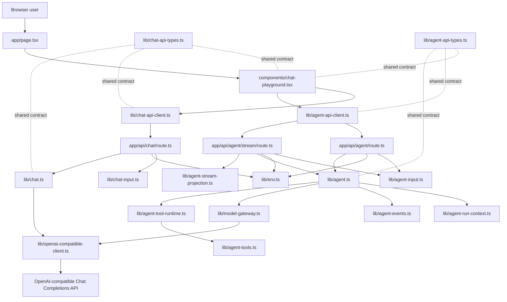
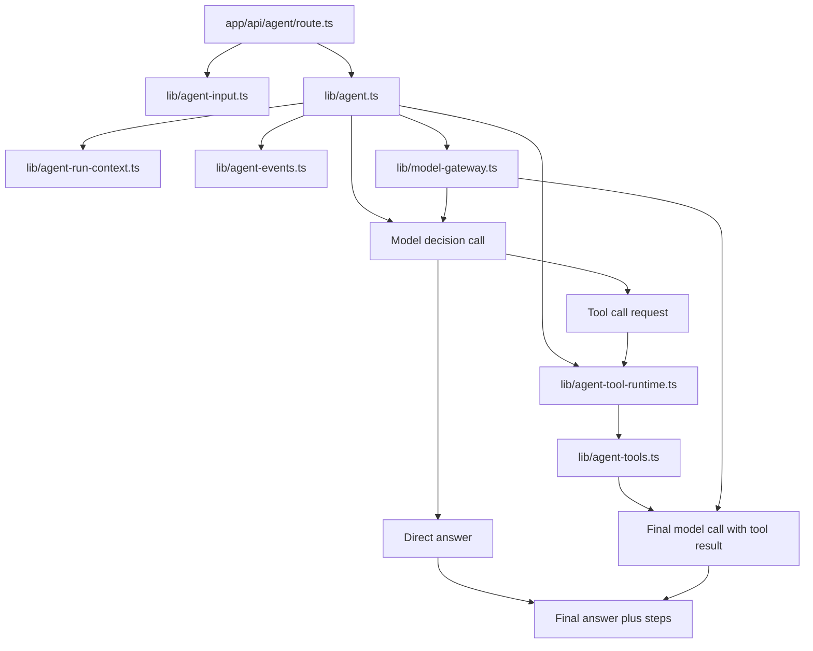
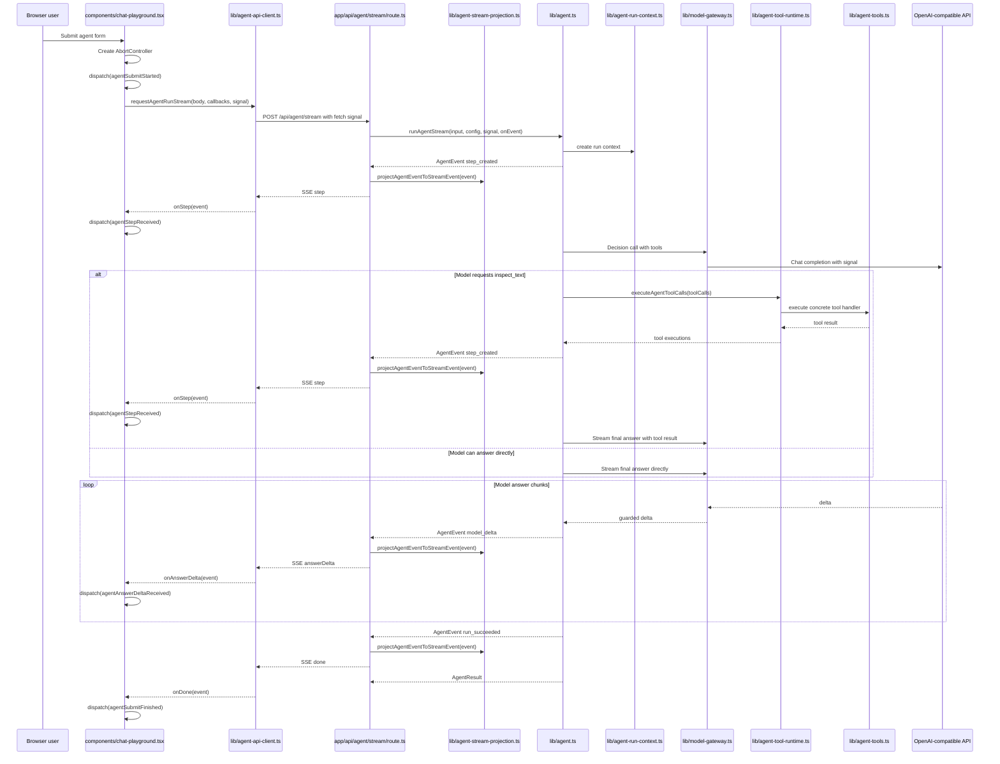

# Architecture

This document is the project map. Keep it current when routes, services,
shared API contracts, environment config, or agent flow boundaries change.

## Current Goal

The project is a small Next.js + TypeScript learning backend. It starts from a
clean OpenAI-compatible chat API call and will grow toward an agent backend.

The code should stay easy to inspect:

- HTTP routes stay thin.
- Request validation stays at the input boundary.
- Business logic receives plain TypeScript objects.
- Shared API types describe the frontend/backend contract.
- Framework-specific objects stay close to the framework boundary.

## Runtime Flow



## Layer Map

```text
app/page.tsx                       Server page shell
components/chat-playground.tsx      React client component and UI state
lib/chat-api-client.ts              Browser-side fetch wrapper
lib/chat-api-types.ts               Shared API request/response types
app/api/chat/route.ts               HTTP entry point for /api/chat
lib/chat-input.ts                   Zod request body parsing and validation
lib/env.ts                          Server-side model configuration
lib/openai-compatible-client.ts     OpenAI SDK client creation
lib/chat.ts                         Chat model service
app/api/agent/route.ts              HTTP entry point for /api/agent
app/api/agent/stream/route.ts       SSE entry point for /api/agent/stream
lib/agent-api-client.ts             Browser-side agent fetch wrapper
lib/agent-api-types.ts              Shared agent API request/response types
lib/agent-stream-projection.ts      AgentEvent to SSE API event projection
lib/agent-input.ts                  Zod agent request body parsing and validation
lib/agent-permissions.ts            Approval policy, sandbox mode, and permission decisions
lib/agent-run-context.ts            Agent run lifecycle context and cancellation checks
lib/agent-events.ts                 Agent runtime event and run state types
lib/agent-log.ts                    Structured server log helpers for agent runs
lib/agent-tool-runtime.ts           Agent tool execution lifecycle boundary
lib/agent-tools.ts                  Local agent tool registry and concrete handlers
lib/model-gateway.ts                Model provider call boundary for agent runs
lib/agent.ts                        Tool-using agent orchestration service
```

## Boundary Rules

### Frontend

`components/chat-playground.tsx` owns browser interaction state:

- form fields
- selected API mode
- submit state
- success/error display state
- calls to `requestChatCompletion(...)`
- calls to `requestAgentRunStream(...)`
- reducer actions for streamed agent steps and answer deltas

It should not read `process.env`, create an OpenAI SDK client, or know how the
server talks to the model provider.

### Browser API Client

`lib/chat-api-client.ts` owns the `fetch('/api/chat')` call and response shape
checking.

`lib/agent-api-client.ts` owns the `fetch('/api/agent')` call and response shape
checking.

It also owns the `fetch('/api/agent/stream')` call and SSE parsing for dynamic
agent runs.

These clients should convert unknown JSON into typed API responses before the
React component uses them.

### Route Handler

`app/api/chat/route.ts` owns the HTTP boundary:

- read `NextRequest`
- parse JSON
- call `parseChatInput(...)`
- read model config
- call `callChatModel(...)`
- return `NextResponse.json(...)`

It should stay thin. Do not put model prompts, tool execution, or agent loops
inside route handlers.

`app/api/agent/route.ts` follows the same boundary shape for `/api/agent`:

- read `NextRequest`
- parse JSON
- call `parseAgentInput(...)`
- read model config
- call `runAgent(...)`
- return `NextResponse.json(...)`

`app/api/agent/stream/route.ts` follows the same validation and configuration
boundary, then returns Server-Sent Events:

- `step` events append inspectable agent steps
- `answerDelta` events stream final answer text
- `done` events carry the final `AgentResult`
- `error` events carry stream-time failures

### Input Validation

`lib/chat-input.ts` owns Zod validation for `/api/chat`.

It converts `unknown` request bodies into a stable `ChatInput` business object.

`lib/agent-input.ts` owns Zod validation for `/api/agent`.

It converts `unknown` request bodies into a stable `AgentInput` business object
with `task`, `goal`, `context`, `model`, and `temperature`.

### Service

`lib/chat.ts` owns the model call.

It receives `ChatInput` and `ModelConfig`, creates no HTTP response, and returns
a plain `ChatResult`.

`lib/agent.ts` owns the first agent orchestration path.

It receives `AgentInput` and `ModelConfig`, builds a model prompt, asks the
model whether it needs a local tool, executes requested tools, asks the model
for a final answer when a tool was used, and returns a plain `AgentResult` with
inspectable steps. It should coordinate agent steps and lifecycle checks rather
than directly create SDK clients or pass SDK request options.

`lib/agent-run-context.ts` owns per-run lifecycle context.

It currently contains `runId`, `AbortSignal`, and `AgentRunPolicy` plus the
shared cancellation check. Future runtime-level concerns such as trace sinks,
checkpoints, retry budgets, and approval wait state should attach to this
boundary instead of being passed as unrelated optional parameters.

`lib/agent-permissions.ts` owns the approval decision model.

It defines tool annotations, approval policy, sandbox mode, permission requests,
and permission decisions. It does not execute tools and does not enforce OS-level
sandboxing.

`lib/agent-events.ts` owns the first internal agent harness event contract.

`AgentEvent` is the runtime truth for what happened during a run. `AgentStep`
is still the current frontend-friendly display projection. `lib/agent.ts`
emits internal events such as `run_started`, `model_started`, `model_delta`,
`tool_requested`, `tool_started`, `tool_finished`, `step_created`, and
`run_succeeded`. The streaming route sends frontend SSE events by projecting
these runtime events through `lib/agent-stream-projection.ts`.

`lib/agent-stream-projection.ts` owns the compatibility layer from runtime
events to the current browser stream contract:

- `step_created` becomes `step`
- `model_delta` becomes `answerDelta`
- `run_succeeded` becomes `done`
- `run_failed` becomes `error`

Tool lifecycle events currently stay server-side only. They are logged as
runtime events but are not exposed to the existing React UI.

Permission events currently stay server-side only. `tool_permission_decided`
records each runtime permission decision. `approval_requested` records that a
tool call needs user approval, but interactive approval resume is not
implemented yet.

For `model_started`, the `stage` field describes why the model call is starting.
`tool_or_answer_selection` means the agent is asking the model to choose whether
to answer directly or request a tool. `answer_generation` means the agent is
asking the model to generate the final answer text.

`AgentRunState` is a small derived state object built by applying events in
order. It is not persistent yet. Its purpose is to make future cancellation,
retry, approval, user-input, and resume behavior hang from one runtime model
instead of scattered callbacks.

`lib/model-gateway.ts` owns model provider calls for agent runs.

It creates the OpenAI-compatible SDK client, applies the configured model,
forwards the agent run `AbortSignal`, and exposes narrow `createChatCompletion`
and `streamChatCompletion` methods. This module is the first place to add
provider adapters for Anthropic or other non-OpenAI message formats.

`lib/agent-tool-runtime.ts` owns the tool execution lifecycle.

It receives model tool calls, checks run cancellation, looks up tools by name in
the registry, asks the permission runtime for a decision, emits tool runtime
events, executes concrete tool handlers, and returns tool execution results.
This keeps `lib/agent.ts` focused on orchestration instead of tool lifecycle
details. Later versions can add tool timeouts, retries, interactive approval
resume, and output validation at this boundary.

`lib/agent-tools.ts` owns the local tool registry and concrete local agent
tools.

Each tool definition groups the tool name, the Chat Completions tool definition,
tool annotations, argument parsing, and the concrete handler. The first
registered tool is `inspect_text`, which returns basic text statistics.

`lib/agent-log.ts` owns structured server logs for `/api/agent`.

Agent logs include a per-request `runId`, event names, full parsed user input,
the assembled model prompt, each step output, final answer, model metadata, and
field lengths. They should not include API keys or other environment secrets.

### Environment

`lib/env.ts` owns server-only environment variables.

Browser files should not import this module.

## Agent Shape

The first agent endpoint uses the same layered shape:

```text
app/api/agent/route.ts              HTTP entry point for /api/agent
app/api/agent/stream/route.ts       SSE entry point for /api/agent/stream
lib/agent-api-types.ts              Shared API request/response types
lib/agent-stream-projection.ts      AgentEvent to SSE API event projection
lib/agent-input.ts                  Zod request body parsing and validation
lib/agent-permissions.ts            Approval and sandbox policy decisions
lib/agent-run-context.ts            Per-run lifecycle context and cancellation
lib/agent-events.ts                 Internal runtime events and derived run state
lib/agent-log.ts                    Structured server log helpers
lib/agent-tool-runtime.ts           Tool execution lifecycle boundary
lib/agent-tools.ts                  Concrete local tool registry and handlers
lib/model-gateway.ts                Model provider boundary for agent runtime
lib/agent.ts                        Agent orchestration service
```

This version has a small tool loop plus a streaming route. The model can answer
directly, or it can request the local `inspect_text` tool before the final
answer. In the UI, steps arrive as soon as the backend emits them, and final
answer text arrives as `answerDelta` events:



## Streaming UI Flow

The streaming path keeps the agent runtime on the server and uses React as an
observer of the run. The browser does not execute tools or call the model.



State ownership in the React component is intentionally narrow:

- `agentSubmitStarted` switches `agentView` to `streaming` and clears old output.
- `agentStepReceived` appends one `AgentStep` to `agentView.steps`.
- `agentAnswerDeltaReceived` appends text to `agentView.answer`.
- `agentRunAborted` preserves already received steps and answer text, then marks
  the run as `aborted`.
- `agentSubmitFinished` replaces the temporary streaming state with the final
  `AgentResult`.

Cancellation uses the platform abort chain rather than a model instruction:

- `components/chat-playground.tsx` owns an `AbortController` for the current
  agent run.
- `lib/agent-api-client.ts` passes the `AbortSignal` to `fetch(...)`.
- `app/api/agent/stream/route.ts` reads `request.signal` and passes it into the
  agent service.
- `lib/agent-run-context.ts` makes the signal part of the agent run lifecycle.
- `lib/model-gateway.ts` passes the same signal into OpenAI SDK request options
  and guards streamed chunks.
- `lib/agent.ts` checks the run context between agent stages such as prompt
  construction and tool execution.

Typing a new "stop" instruction into the model is not a true cancellation of the
in-flight request. It is just another future request. The real interruption path
is aborting the current HTTP/model request.

## Permission And Sandbox Design

The permission model follows the Codex-style separation between tool facts,
approval policy, and sandbox boundaries.

```text
Tool annotations     What the tool says about its behavior
Approval policy      Whether this run should auto-allow, ask, or deny
Sandbox mode         What the execution environment can actually touch
Hooks / guardian     Future dynamic policy layers
User approval        Future interactive final decision
```

These layers must stay separate. A tool does not decide whether it may run. A
tool only declares behavior hints. The runtime decides whether the current call
is allowed under the current run policy. The sandbox, once implemented, enforces
hard execution boundaries even after approval.

Tool annotations are multi-dimensional facts, not a single risk level:

```ts
type AgentToolAnnotations = {
  readOnly?: boolean;
  destructive?: boolean;
  openWorld?: boolean;
  idempotent?: boolean;
};
```

`undefined` means unknown, not false. Unknown hints are treated conservatively.
The current `inspect_text` tool declares:

```text
readOnly=true
destructive=false
openWorld=false
idempotent=true
```

Approval policy is run-level configuration:

```text
strict      Only known-safe tools are auto-approved.
on_request  Default. Known-safe tools are auto-approved; unknown/risky tools ask.
never       Never ask for interactive approval. This is not the same as sandbox bypass.
```

Sandbox mode is also run-level configuration:

```text
read_only
workspace_write
danger_full_access
```

Current implementation status:

- `AgentRunPolicy` exists on `AgentRunContext`.
- The default is `approvalPolicy=on_request` and `sandboxMode=read_only`.
- `AgentToolRuntime` creates an `AgentPermissionRequest` before executing a
  tool.
- `decideAgentToolPermission(...)` currently uses approval policy plus tool
  annotations.
- Known-safe tools are allowed.
- Unknown, destructive, or open-world tools ask for approval.
- Interactive approval resume is not implemented yet, so an `ask` decision emits
  `approval_requested` and then raises `AgentApprovalRequiredError` as a
  fail-closed placeholder.
- Sandbox mode is declared but not enforced yet.

`danger_full_access` belongs to sandbox mode, not to individual tools. It should
be selected by the user, app, or run configuration. It must not be inferred from
the model or from a tool call.

Future decision order should be:

```text
tool-level/user config override
  -> hook/rule engine
  -> global approval policy + tool annotations
  -> guardian/classifier if added
  -> user approval if interactive
  -> sandbox enforcement at execution time
```

Every decision should remain auditable through event logs. Current decisions use
`tool_permission_decided`; future interactive pauses use `approval_requested`.
`AgentApprovalRequiredError` is not the final approval design. It only marks the
current unsupported pause point until the runtime has session storage, approval
responses, and resume support.

### Approval Pause Semantics

`tool_permission_decided` and `approval_requested` are intentionally separate.

`tool_permission_decided` is an audit event. It records the decision made by the
permission runtime:

```text
allow  The tool call may continue.
ask    The tool call needs approval before execution.
deny   The tool call is rejected by policy.
```

This event does not by itself move the run into a waiting state. It records what
the policy decided.

`approval_requested` is a workflow event. It means the run has reached a point
where tool execution cannot continue without an external approval response. This
event moves `AgentRunState.status` to `waiting_for_approval`.

The current runtime does not yet have a durable run store, an approval response
API, or resume support. Because of that, an `ask` decision follows this
fail-closed sequence:

```text
tool_permission_decided(ask)
approval_requested
throw AgentApprovalRequiredError
```

This is a temporary bridge, not the final architecture. The error is explicit so
callers can distinguish "approval is required but unsupported" from ordinary tool
failure or policy denial.

The final approval flow should replace this throw with a pause/resume protocol:

```text
tool_permission_decided(ask)
approval_requested
persist run state and pending tool call
return or stream waiting_for_approval to the client
client/user approves or denies
resume the same run from the pending tool call
```

`AgentPermissionDeniedError` is different. A `deny` decision is terminal for the
current tool call and may fail the run immediately unless a future policy layer
chooses to feed the denial back to the model as a recoverable tool result.

The next agent boundary can add these modules when the runtime needs them:

```text
lib/agent-session-store.ts          Append-only event log and resumable runs
lib/tools/*.ts                      Larger tool families
```

`lib/agent-tool-runtime.ts` now exists as the first tool lifecycle boundary.
`lib/agent-tools.ts` now contains the local tool registry:

```text
tool name -> annotations -> input schema -> handler -> output schema
```

The current registry includes the name, annotations, input parsing, and handler.
Output schema is the next part to add when the tool boundary needs stricter
contracts.

## Agent Harness Direction

The long-term target is an agent runtime/harness, not only a single service that
calls a model. In this project, harness means the backend layer around the model
that controls:

- task and context assembly
- model-provider calls
- tool registration and execution
- cancellation and retry boundaries
- permission and approval pauses
- user input during a run
- append-only run events
- derived run state
- logs, traceability, and future replay/evaluation

The model remains one component inside the harness. The harness owns the loop:

```text
user task -> runtime event -> model call -> tool request -> tool execution
          -> runtime event -> final answer or next loop
```

The current implementation is intentionally small:

- `AgentEvent` is the internal runtime event contract.
- `AgentRunState` is derived from events.
- `AgentToolRuntime` wraps concrete tool execution and emits tool lifecycle
  events.
- `AgentPermissions` makes annotation-based approval decisions before tool
  execution.
- `AgentStreamProjection` maps runtime events to the current frontend SSE
  contract.
- Existing `AgentStep` objects remain the frontend display contract.
- Existing SSE events remain compatible with the current React UI.

Future work should grow the harness in this order:

1. add interactive approval resume and user-input events
2. persist the event log so a run can be inspected, retried, or resumed
3. enforce sandbox mode for file, shell, network, or external API tools
4. add provider-neutral model message contracts after the runtime loop is stable

## Maintenance Rule

Update this document in the same change when any of these change:

- a route is added, removed, or renamed
- a `lib/*` module changes responsibility
- a shared API request/response type changes
- an agent loop or tool boundary is added
- frontend data flow changes in a way that affects API calls

For small code edits that do not change module responsibilities, no architecture
update is needed.
