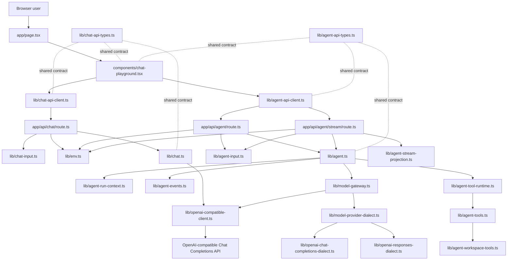
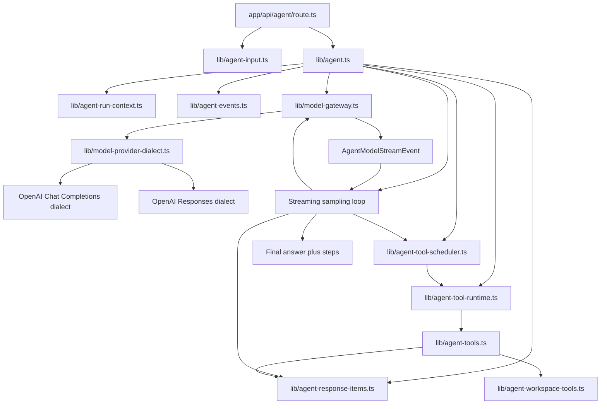

# Architecture

This document is the project map. Keep it current when routes, services,
shared API contracts, environment config, or agent flow boundaries change.

## Current Goal

The project is a small Next.js + TypeScript learning backend. It starts from a
clean OpenAI-compatible chat API call and will grow toward an agent backend.

The code should stay easy to inspect:

- HTTP routes stay thin.
- Request validation stays at the input boundary.
- Business logic receives plain TypeScript objects.
- Shared API types describe the frontend/backend contract.
- Framework-specific objects stay close to the framework boundary.

## Runtime Flow



## Layer Map

```text
app/page.tsx                       Server page shell
components/chat-playground.tsx      React client component and UI state
lib/chat-api-client.ts              Browser-side fetch wrapper
lib/chat-api-types.ts               Shared API request/response types
app/api/chat/route.ts               HTTP entry point for /api/chat
lib/chat-input.ts                   Zod request body parsing and validation
lib/env.ts                          Server-side model configuration
lib/openai-compatible-client.ts     OpenAI SDK client creation
lib/chat.ts                         Chat model service
app/api/agent/route.ts              HTTP entry point for /api/agent
app/api/agent/stream/route.ts       SSE entry point for /api/agent/stream
app/api/agent/sessions/route.ts     HTTP entry point for listing agent sessions
app/api/agent/sessions/[id]/route.ts HTTP entry point for reading one agent session
lib/agent-api-client.ts             Browser-side agent fetch wrapper
lib/agent-api-types.ts              Shared agent API request/response types
lib/agent-stream-projection.ts      AgentEvent to SSE API event projection
lib/agent-model-types.ts            Provider-neutral model request/response/event types
lib/agent-model-stages.ts           Shared model-call stage constants
lib/agent-usage.ts                  Token usage normalization and aggregation
lib/agent-input.ts                  Zod agent request body parsing and validation
lib/agent-permissions.ts            Approval policy, sandbox mode, and permission decisions
lib/agent-run-context.ts            Agent run lifecycle context and cancellation checks
lib/agent-events.ts                 Agent runtime event and run state types
lib/agent-session-store.ts          JSONL session rollout writer and reader
lib/agent-log.ts                    Structured server log helpers for agent runs
lib/agent-tool-runtime.ts           Agent tool execution lifecycle boundary
lib/agent-tools.ts                  Local agent tool registry and concrete handlers
lib/agent-workspace-tools.ts        Read-only workspace file exploration tools
lib/model-provider-dialect.ts       Provider dialect contract
lib/openai-chat-completions-dialect.ts OpenAI Chat Completions dialect adapter
lib/openai-responses-dialect.ts     OpenAI Responses dialect adapter
lib/model-gateway.ts                Provider dialect selection and model call boundary
lib/agent.ts                        Tool-using agent orchestration service
```

## Boundary Rules

### Frontend

`components/chat-playground.tsx` owns browser interaction state:

- form fields
- selected API mode
- submit state
- success/error display state
- calls to `requestChatCompletion(...)`
- calls to `requestAgentRunStream(...)`
- reducer actions for streamed agent steps and assistant deltas

It should not read `process.env`, create an OpenAI SDK client, or know how the
server talks to the model provider.

### Browser API Client

`lib/chat-api-client.ts` owns the `fetch('/api/chat')` call and response shape
checking.

`lib/agent-api-client.ts` owns the `fetch('/api/agent')` call and response shape
checking.

It also owns the `fetch('/api/agent/stream')` call and SSE parsing for dynamic
agent runs.

These clients should convert unknown JSON into typed API responses before the
React component uses them.

### Route Handler

`app/api/chat/route.ts` owns the HTTP boundary:

- read `NextRequest`
- parse JSON
- call `parseChatInput(...)`
- read model config
- call `callChatModel(...)`
- return `NextResponse.json(...)`

It should stay thin. Do not put model prompts, tool execution, or agent loops
inside route handlers.

`app/api/agent/route.ts` follows the same boundary shape for `/api/agent`:

- read `NextRequest`
- parse JSON
- call `parseAgentInput(...)`
- read model config
- call `runAgent(...)`
- return `NextResponse.json(...)`

`app/api/agent/stream/route.ts` follows the same validation and configuration
boundary, then returns Server-Sent Events:

- `step` events append inspectable agent steps
- `assistantDelta` events stream assistant text; the runtime cannot know whether
  a streamed message is final until the sampling round ends
- `done` events carry the final `AgentResult`
- `error` events carry stream-time failures

### Input Validation

`lib/chat-input.ts` owns Zod validation for `/api/chat`.

It converts `unknown` request bodies into a stable `ChatInput` business object.

`lib/agent-input.ts` owns Zod validation for `/api/agent`.

It converts `unknown` request bodies into a stable `AgentInput` business object
with `task`, `goal`, `context`, `model`, and `temperature`.

### Service

`lib/chat.ts` owns the model call.

It receives `ChatInput` and `ModelConfig`, creates no HTTP response, and returns
a plain `ChatResult`.

`lib/agent.ts` owns the first agent orchestration path.

It receives `AgentInput` and `ModelConfig`, builds a model prompt, runs
provider-neutral streaming sampling rounds, executes requested tools, and
returns a plain `AgentResult` with inspectable steps. A round that commits
assistant text and requests no tools is the final answer round. There is no
extra final-answer model call after the tool loop. The service should
coordinate agent steps and lifecycle checks rather than directly create SDK
clients or pass SDK request options.

`lib/agent-run-context.ts` owns per-run lifecycle context.

It currently contains `runId`, `AbortSignal`, and `AgentRunPolicy` plus the
shared cancellation check. Future runtime-level concerns such as trace sinks,
checkpoints, retry budgets, and approval wait state should attach to this
boundary instead of being passed as unrelated optional parameters.

`lib/agent-permissions.ts` owns the approval decision model.

It defines tool annotations, approval policy, sandbox mode, permission requests,
and permission decisions. It does not execute tools and does not enforce OS-level
sandboxing.

`lib/agent-events.ts` owns the first internal agent harness event contract.

`AgentEvent` is the runtime truth for what happened during a run. `AgentStep`
is still the current frontend-friendly display projection. `lib/agent.ts`
emits internal events such as `run_started`, `model_started`,
`assistant_delta`, `tool_requested`, `tool_started`, `tool_finished`,
`step_created`, and `run_succeeded`. The streaming route sends frontend SSE
events by projecting these runtime events through
`lib/agent-stream-projection.ts`.

`lib/agent-stream-projection.ts` owns the projection from runtime events to the
browser stream contract:

- `step_created` becomes `step`
- `assistant_delta` becomes `assistantDelta`
- `run_succeeded` becomes `done`
- `run_failed` becomes `error`

Tool lifecycle events currently stay server-side only. They are logged as
runtime events but are not exposed to the existing React UI.

Permission events currently stay server-side only. `tool_permission_decided`
records each runtime permission decision. `approval_requested` records that a
tool call needs user approval, but interactive approval resume is not
implemented yet.

`lib/agent-model-stages.ts` owns the shared model-call stage names used by
events and usage records. This avoids redefining string stage names separately
in event and response contracts.

`lib/agent-model-types.ts` owns the provider-neutral model IR for the agent
runtime.

This is the anti-corruption layer between the agent loop and provider protocols.
`lib/agent.ts` talks in terms of:

```ts
AgentModelMessage;
AgentModelToolDefinition;
AgentModelToolCall;
AgentModelRequest;
AgentModelStreamEvent;
```

It must not import OpenAI Chat Completions, OpenAI Responses, Anthropic
Messages, or any other provider wire types. This is the same architectural role
that a database query AST plays before a SQL dialect compiles it to one
database's SQL.

Tool definitions in this IR use agent-owned field names:

```ts
type AgentModelToolDefinition = {
  name: string;
  description: string;
  inputSchema: Record<string, unknown>;
  schemaStrict: boolean;
};
```

`inputSchema` is the JSON Schema object that describes tool arguments.
`schemaStrict` is the runtime's strict-schema intent. Provider dialects translate
these fields into provider-specific shapes. OpenAI Chat Completions and OpenAI
Responses compile them to `parameters` and `strict`; a future Anthropic dialect
would compile `inputSchema` to Anthropic's `input_schema` and either ignore or
adapt `schemaStrict`.

`lib/model-provider-dialect.ts` owns the provider dialect contract.

A dialect is responsible for compiling the agent model IR into one wire API and
parsing provider output back into provider-neutral responses and stream events.
The agent loop consumes the stream event contract for every sampling round:

```ts
type AgentModelStreamEvent =
  | { type: 'text_delta'; delta: string }
  | {
      type: 'assistant_message_done';
      message: {
        text: string;
        providerPhase: 'commentary' | 'final_answer' | null;
      };
    }
  | {
      type: 'tool_call_delta';
      index: number | undefined;
      itemId: string | undefined;
      toolCallId: string | undefined;
      name: string | undefined;
      delta: string;
    }
  | { type: 'tool_call_committed'; toolCall: AgentModelToolCall }
  | { type: 'completed'; model: string; usage: AgentModelUsageSnapshot };
```

`text_delta` is provisional display text. `assistant_message_done` is the commit
point for one assistant message. `tool_call_committed` is the only signal that makes
the agent continue to tools. Provider metadata such as OpenAI Responses
`phase: "commentary" | "final_answer"` is preserved on committed assistant
messages when present, but the core loop does not use it as the stop condition.

The current dialects are:

```text
openai-chat-completions  lib/openai-chat-completions-dialect.ts
openai-responses         lib/openai-responses-dialect.ts
```

Both dialects expose the same capabilities shape:

```ts
type AgentModelCapabilities = {
  tools: boolean;
  streaming: boolean;
  streamingUsage: boolean;
  parallelToolCalls: boolean;
};
```

Provider quirks should stay in dialect files. Runtime code should not branch on
provider-specific fields like `tool_calls`, `function_call_output`,
`response.output_text.delta`, or `stream_options`.

`lib/agent-usage.ts` owns token usage normalization and aggregation.

Single model-call token numbers come from provider dialects. OpenAI Chat
Completions maps `prompt_tokens`, `completion_tokens`, and `total_tokens`.
OpenAI Responses maps `input_tokens`, `output_tokens`, and `total_tokens`. The
agent normalizes those raw values into:

```ts
type AgentTokenUsage = {
  inputTokens: number;
  cachedInputTokens: number | null;
  outputTokens: number;
  reasoningOutputTokens: number;
  totalTokens: number;
};
```

`AgentResult.usage` keeps both the per-call records and the runtime-computed
total:

```ts
type AgentUsage = {
  totalTokenUsage: AgentTokenUsage;
  lastTokenUsage: AgentTokenUsage | null;
  calls: AgentModelCallUsage[];
};
```

`cachedInputTokens` is nullable by design. `0` means the provider explicitly
reported zero cached input tokens. `null` means the provider did not report the
cache-hit field, so the runtime does not know whether cache was used. When
aggregating calls, any unknown cached-token value makes the aggregate
`cachedInputTokens` unknown as well. The runtime only sums calls that include
token usage. Each call still keeps `rawUsage` so provider-specific fields are
not lost.

`lib/agent-session-store.ts` owns JSONL session rollout files.

It writes inspectable append-only session records for streaming agent runs. Each
line is a JSON object with `timestamp`, `type`, and `payload`. The first line is
`session_meta`, the second line is the current `turn_context`, and subsequent
`agent_event` rows mirror runtime events while `response_item` rows persist the
model-visible history emitted by `lib/agent.ts`.

Current files are written under:

```text
data/agent-sessions/YYYY/MM/DD/rollout-{timestamp}-{runId}.jsonl
```

`data/agent-sessions/` is ignored by git because session files can contain user
input, prompts, tool arguments, model output, and other sensitive runtime data.
This module is currently used by `/api/agent/stream`; `/api/agent` still runs
the same model-history loop without persisting a session file.

`app/api/agent/sessions/route.ts` exposes `GET /api/agent/sessions`.

It lists local JSONL sessions and returns summaries such as session id, created
time, updated time, model, wire API, approval policy, sandbox mode, record
count, and relative path. It does not return full records.

`app/api/agent/sessions/[id]/route.ts` exposes `GET /api/agent/sessions/:id`.

It reads one JSONL session by `session_meta.payload.id` and returns the parsed
records. This is an inspect/debug API only. It does not resume a run and does
not reconstruct model-visible history.

For `model_started`, the `stage` field describes why the model call is starting.
The current streaming sampling loop uses `tool_or_answer_selection` because each
round lets the model either answer directly or request tools. `answer_generation`
is kept in the shared enum for earlier session records and future no-tool-only
answer calls, but the current agent runtime no longer performs a separate final
answer model call.

`AgentRunState` is a small derived state object built by applying events in
order. It is not persistent yet. Its purpose is to make future cancellation,
retry, approval, user-input, and resume behavior hang from one runtime model
instead of scattered callbacks.

`lib/model-gateway.ts` owns model provider calls for agent runs.

It creates the OpenAI SDK client, selects the configured dialect from
`OPENAI_WIRE_API`, applies the configured model, forwards the agent run
`AbortSignal`, and exposes narrow provider-neutral `createResponse` and
`streamResponse` methods. This module should remain a gateway and registry
boundary. Protocol details belong in dialect files.

`lib/agent-tool-runtime.ts` owns the tool execution lifecycle.

It receives model tool calls, checks run cancellation, looks up tools by name in
the registry, asks the permission runtime for a decision, emits tool runtime
events, executes concrete tool handlers, and returns tool execution results.
This keeps `lib/agent.ts` focused on orchestration instead of tool lifecycle
details. Later versions can add tool timeouts, retries, interactive approval
resume, and output validation at this boundary.

`lib/agent-tools.ts` owns the local tool registry.

Each tool definition groups the tool name, provider-neutral model tool metadata,
tool annotations, argument parsing, and the concrete handler. Dialects compile
the provider-neutral tool metadata into their own wire format. The registry
currently includes `inspect_text` for direct text statistics plus the read-only
workspace exploration tools from `lib/agent-workspace-tools.ts`.

`lib/agent-workspace-tools.ts` owns the concrete workspace read tools:

```text
ls      list workspace directory entries
find    find files by glob-style path pattern
grep    search file contents with ripgrep
read    read UTF-8 text files with line pagination
```

These tools are read-only, non-destructive, closed-world, idempotent, and marked
parallel-capable. Each path is resolved against the current workspace root and
then checked with `realpath`, so `../` paths and symlink escapes fail as ordinary
tool errors. Large outputs return bounded structured data plus actionable
notices, such as using a later `offset` for `read` or narrowing a `grep`
pattern.

`lib/agent-log.ts` owns structured server logs for `/api/agent`.

Agent logs include a per-request `runId`, event names, full parsed user input,
the assembled model prompt, each step output, final answer, model metadata, and
field lengths. They should not include API keys or other environment secrets.

### Environment

`lib/env.ts` owns server-only environment variables.

Browser files should not import this module.

Current model-related variables are:

```text
OPENAI_API_KEY
OPENAI_BASE_URL
OPENAI_MODEL
OPENAI_WIRE_API=openai-chat-completions | openai-responses
```

## Agent Shape

The first agent endpoint uses the same layered shape:

```text
app/api/agent/route.ts              HTTP entry point for /api/agent
app/api/agent/stream/route.ts       SSE entry point for /api/agent/stream
app/api/agent/sessions/route.ts     HTTP entry point for listing agent sessions
app/api/agent/sessions/[id]/route.ts HTTP entry point for reading one agent session
lib/agent-api-types.ts              Shared API request/response types
lib/agent-stream-projection.ts      AgentEvent to SSE API event projection
lib/agent-model-types.ts            Provider-neutral model request/response/event types
lib/agent-model-stages.ts           Shared model-call stage constants
lib/agent-usage.ts                  Token usage normalization and aggregation
lib/agent-input.ts                  Zod request body parsing and validation
lib/agent-permissions.ts            Approval and sandbox policy decisions
lib/agent-run-context.ts            Per-run lifecycle context and cancellation
lib/agent-events.ts                 Internal runtime events and derived run state
lib/agent-session-store.ts          JSONL session rollout writer and reader
lib/agent-log.ts                    Structured server log helpers
lib/agent-tool-runtime.ts           Tool execution lifecycle boundary
lib/agent-tools.ts                  Concrete local tool registry and handlers
lib/agent-workspace-tools.ts        Read-only workspace file exploration tools
lib/model-provider-dialect.ts       Provider dialect contract
lib/openai-chat-completions-dialect.ts OpenAI Chat Completions dialect adapter
lib/openai-responses-dialect.ts     OpenAI Responses dialect adapter
lib/model-gateway.ts                Provider dialect selection and model call boundary
lib/agent.ts                        Agent orchestration service
```

This version has the first streaming agent sampling loop with assistant message
commit semantics. The model-visible history is represented by provider-neutral
`AgentResponseItem` records. Every model sampling round uses `streamResponse`,
so the runtime can receive provisional assistant text deltas, assistant message
commit events, tool-call argument deltas, completed tool calls, and final usage
through one provider-neutral stream. If a completed round contains tool calls,
the runtime records any committed assistant messages as working messages,
records the function calls, executes the tool batch, records function-call
outputs, and continues. If a completed round contains no tool calls, the
committed assistant message text is the final answer. There is no extra
final-answer model call.



`AgentResponseItem` currently has three variants:

```ts
type AgentResponseItem =
  | {
      type: 'message';
      role: 'system' | 'user' | 'assistant';
      content: string;
      providerPhase?: 'commentary' | 'final_answer' | null;
      runtimeRole?: 'working_message' | 'final_response';
    }
  | {
      type: 'function_call';
      callId: string;
      name: string;
      argumentsJson: string;
    }
  | {
      type: 'function_call_output';
      callId: string;
      toolName: string;
      output: unknown;
      isError: boolean;
    };
```

`lib/agent-response-items.ts` converts this history into
`AgentModelMessage[]` before handing it to the selected provider dialect.
Provider wire details remain inside the dialect files. `providerPhase` is
provider metadata that may be useful for Responses-compatible models. It is not
the agent loop stop condition. `runtimeRole` records how the agent loop
classified a committed assistant message after the sampling round completed.

Tool batching is handled by `lib/agent-tool-scheduler.ts`:

```text
all tool calls in batch have executionMode="parallel" -> run with Promise.all
otherwise                                           -> run sequentially
```

Even when tools run in parallel, `function_call_output` records are appended in
the model's original tool-call order. Runtime events may reflect real completion
order; model history stays deterministic.

Data dependency is not inferred by the runtime. If one tool needs another
tool's output, the model should request the second tool in a later round after
the first `function_call_output` is present in history. The scheduler only
decides whether a single already-emitted batch is safe to run concurrently based
on explicit tool metadata.

Ordinary tool errors such as unknown tool names, invalid arguments, or handler
exceptions become error-shaped `function_call_output` records. That keeps the
model loop recoverable. Permission pauses and denied policy decisions remain
fail-closed until approval resume exists.

The first production-shaped tool foundation is read-only workspace exploration,
not shell execution. The current tool set gives the model enough structure to
inspect files without a process sandbox:

```text
read(path, offset?, limit?)
grep(pattern, path?, glob?, ignoreCase?, literal?, limit?)
find(pattern, path?, limit?)
ls(path?, limit?)
```

This keeps the safety boundary small while still exercising the same
provider-neutral function-call path that future shell, edit, and MCP tools will
use. `grep` depends on local `rg` and reports a model-visible tool error if it
is unavailable.

## Streaming UI Flow

The streaming path keeps the agent runtime on the server and uses React as an
observer of the run. The browser does not execute tools or call the model.


State ownership in the React component is intentionally narrow:

- `agentSubmitStarted` switches `agentView` to `streaming` and clears old output.
- `agentStepReceived` appends one `AgentStep` to `agentView.steps`.
- `agentAssistantDeltaReceived` appends text to `agentView.answer`.
- `agentRunAborted` preserves already received steps and answer text, then marks
  the run as `aborted`.
- `agentSubmitFinished` replaces the temporary streaming state with the final
  `AgentResult`.

Cancellation uses the platform abort chain rather than a model instruction:

- `components/chat-playground.tsx` owns an `AbortController` for the current
  agent run.
- `lib/agent-api-client.ts` passes the `AbortSignal` to `fetch(...)`.
- `app/api/agent/stream/route.ts` reads `request.signal` and passes it into the
  agent service.
- `lib/agent-run-context.ts` makes the signal part of the agent run lifecycle.
- `lib/model-gateway.ts` passes the same signal into OpenAI SDK request options
  and guards streamed chunks.
- `lib/agent.ts` checks the run context between agent stages such as prompt
  construction and tool execution.

Typing a new "stop" instruction into the model is not a true cancellation of the
in-flight request. It is just another future request. The real interruption path
is aborting the current HTTP/model request.

## Permission And Sandbox Design

The permission model follows the Codex-style separation between tool facts,
approval policy, and sandbox boundaries.

```text
Tool annotations     What the tool says about its behavior
Approval policy      Whether this run should auto-allow, ask, or deny
Sandbox mode         What the execution environment can actually touch
Hooks / guardian     Future dynamic policy layers
User approval        Future interactive final decision
```

These layers must stay separate. A tool does not decide whether it may run. A
tool only declares behavior hints. The runtime decides whether the current call
is allowed under the current run policy. The sandbox, once implemented, enforces
hard execution boundaries even after approval.

Tool annotations are multi-dimensional facts, not a single risk level:

```ts
type AgentToolAnnotations = {
  readOnly?: boolean;
  destructive?: boolean;
  openWorld?: boolean;
  idempotent?: boolean;
};
```

`undefined` means unknown, not false. Unknown hints are treated conservatively.
The current `inspect_text` tool declares:

```text
readOnly=true
destructive=false
openWorld=false
idempotent=true
```

Approval policy is run-level configuration:

```text
strict      Only known-safe tools are auto-approved.
on_request  Default. Known-safe tools are auto-approved; unknown/risky tools ask.
never       Never ask for interactive approval. This is not the same as sandbox bypass.
```

Sandbox mode is also run-level configuration:

```text
read_only
workspace_write
danger_full_access
```

Current implementation status:

- `AgentRunPolicy` exists on `AgentRunContext`.
- The default is `approvalPolicy=on_request` and `sandboxMode=read_only`.
- `AgentToolRuntime` creates an `AgentPermissionRequest` before executing a
  tool.
- `decideAgentToolPermission(...)` currently uses approval policy plus tool
  annotations.
- Known-safe tools are allowed.
- Unknown, destructive, or open-world tools ask for approval.
- Interactive approval resume is not implemented yet, so an `ask` decision emits
  `approval_requested` and then raises `AgentApprovalRequiredError` as a
  fail-closed placeholder.
- Sandbox mode is declared but not enforced yet.

`danger_full_access` belongs to sandbox mode, not to individual tools. It should
be selected by the user, app, or run configuration. It must not be inferred from
the model or from a tool call.

Future decision order should be:

```text
tool-level/user config override
  -> hook/rule engine
  -> global approval policy + tool annotations
  -> guardian/classifier if added
  -> user approval if interactive
  -> sandbox enforcement at execution time
```

Every decision should remain auditable through event logs. Current decisions use
`tool_permission_decided`; future interactive pauses use `approval_requested`.
`AgentApprovalRequiredError` is not the final approval design. It only marks the
current unsupported pause point until the runtime has session storage, approval
responses, and resume support.

### Approval Pause Semantics

`tool_permission_decided` and `approval_requested` are intentionally separate.

`tool_permission_decided` is an audit event. It records the decision made by the
permission runtime:

```text
allow  The tool call may continue.
ask    The tool call needs approval before execution.
deny   The tool call is rejected by policy.
```

This event does not by itself move the run into a waiting state. It records what
the policy decided.

`approval_requested` is a workflow event. It means the run has reached a point
where tool execution cannot continue without an external approval response. This
event moves `AgentRunState.status` to `waiting_for_approval`.

The current runtime does not yet have a durable run store, an approval response
API, or resume support. Because of that, an `ask` decision follows this
fail-closed sequence:

```text
tool_permission_decided(ask)
approval_requested
throw AgentApprovalRequiredError
```

This is a temporary bridge, not the final architecture. The error is explicit so
callers can distinguish "approval is required but unsupported" from ordinary tool
failure or policy denial.

The final approval flow should replace this throw with a pause/resume protocol:

```text
tool_permission_decided(ask)
approval_requested
persist run state and pending tool call in JSONL session records
return or stream waiting_for_approval to the client
client/user approves or denies
resume the same run from the pending tool call
```

`AgentPermissionDeniedError` is different. A `deny` decision is terminal for the
current tool call and may fail the run immediately unless a future policy layer
chooses to feed the denial back to the model as a recoverable tool result.

## Session Rollout Design

The session store follows the Codex-style rollout idea in a smaller form. Codex
stores a full session as JSONL with tagged rows such as `session_meta`,
`response_item`, `event_msg`, `turn_context`, and `compacted`. This project now
persists both runtime events and provider-neutral model-visible history.

Current row shape:

```ts
type AgentSessionRecord =
  | { timestamp: string; type: 'session_meta'; payload: AgentSessionMeta }
  | { timestamp: string; type: 'turn_context'; payload: AgentTurnContext }
  | { timestamp: string; type: 'agent_event'; payload: AgentEvent }
  | { timestamp: string; type: 'response_item'; payload: AgentResponseItem };
```

Example file:

```text
{"timestamp":"...","type":"session_meta","payload":{"id":"...","cwd":"...","source":"api_agent_stream",...}}
{"timestamp":"...","type":"turn_context","payload":{"turnId":"...","model":"...","wireApi":"openai-chat-completions","approvalPolicy":"on_request","sandboxMode":"read_only"}}
{"timestamp":"...","type":"response_item","payload":{"type":"message","role":"system","content":"..."}}
{"timestamp":"...","type":"response_item","payload":{"type":"message","role":"user","content":"..."}}
{"timestamp":"...","type":"agent_event","payload":{"type":"run_started","runId":"..."}}
{"timestamp":"...","type":"agent_event","payload":{"type":"step_created","step":{...}}}
{"timestamp":"...","type":"response_item","payload":{"type":"function_call","callId":"...","name":"inspect_text","argumentsJson":"..."}}
{"timestamp":"...","type":"response_item","payload":{"type":"function_call_output","callId":"...","toolName":"inspect_text","output":{...},"isError":false}}
{"timestamp":"...","type":"agent_event","payload":{"type":"run_succeeded","result":{"usage":{"totalTokenUsage":{...},"lastTokenUsage":{...},"calls":[...]}}}}
```

Current guarantees:

- records are append-only
- every append writes one JSONL line
- writes are synchronous in the current request so write failures fail fast
- session files survive process restart
- session files are not committed to git
- local API clients can list sessions and read full records by id
- final results include normalized per-call token usage and summed token usage
- streaming agent runs persist `response_item` rows for system/user messages,
  function calls, function-call outputs, and final assistant messages

Current limitations:

- no resume API yet
- no compaction rows yet
- no model-history reconstruction yet
- approval resume is not implemented yet
- session read/list APIs are for local inspection and debugging

Future session work should add:

```text
event_msg        UI/internal events that are not model-visible
compacted        summary plus optional replacement history
approval API     approve or deny a pending approval_requested event
resume API       reconstruct AgentRunState and model history from JSONL
```

The next agent boundary can add these modules when the runtime needs them:

```text
lib/tools/*.ts                      Larger tool families
```

`lib/agent-tool-runtime.ts` now exists as the first tool lifecycle boundary.
`lib/agent-tools.ts` now contains the local tool registry:

```text
tool name -> annotations -> input schema -> handler -> output schema
```

The current registry includes the name, annotations, provider-neutral
`inputSchema`, runtime input parsing, and handler. Output schema is the next
part to add when the tool boundary needs stricter contracts.

## Agent Harness Direction

The long-term target is an agent runtime/harness, not only a single service that
calls a model. In this project, harness means the backend layer around the model
that controls:

- task and context assembly
- model-provider calls
- tool registration and execution
- cancellation and retry boundaries
- permission and approval pauses
- user input during a run
- append-only run events
- derived run state
- logs, traceability, and future replay/evaluation

The model remains one component inside the harness. The harness owns the loop:

```text
user task -> runtime event -> model call -> tool request -> tool execution
          -> runtime event -> final answer or next loop
```

The current implementation is intentionally small:

- `AgentEvent` is the internal runtime event contract.
- `AgentRunState` is derived from events.
- `AgentResponseItem` is the provider-neutral model-visible history contract.
- `AgentToolScheduler` chooses sequential or opt-in parallel execution for a
  batch of tool calls.
- `AgentToolRuntime` wraps concrete tool execution and emits tool lifecycle
  events.
- `AgentPermissions` makes annotation-based approval decisions before tool
  execution.
- `AgentStreamProjection` maps runtime events to the current frontend SSE
  contract.
- `AgentSessionStore` persists streaming run metadata, turn context, runtime
  events, and model-visible `response_item` records as JSONL.
- Existing `AgentStep` objects remain the frontend display contract.
- Existing SSE events remain compatible with the current React UI.

Future work should grow the harness in this order:

1. add interactive approval resume and user-input events
2. enforce sandbox mode for file, shell, network, or external API tools
3. add compaction and history reconstruction
4. add richer tools and MCP-style external tool registration

## Maintenance Rule

Update this document in the same change when any of these change:

- a route is added, removed, or renamed
- a `lib/*` module changes responsibility
- a shared API request/response type changes
- an agent loop or tool boundary is added
- frontend data flow changes in a way that affects API calls

For small code edits that do not change module responsibilities, no architecture
update is needed.
