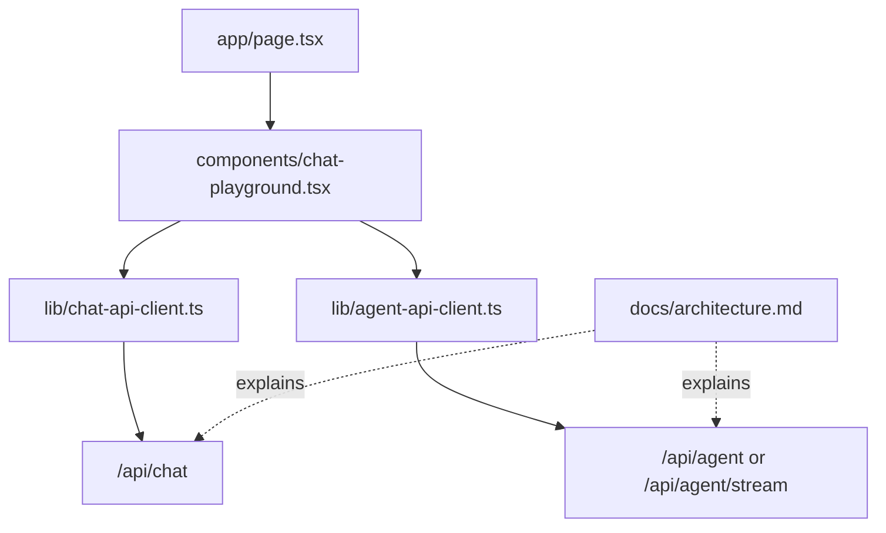

# 03. Living Architecture And Workbench

This chapter explains why the project needs both a living architecture document
and an interactive frontend workbench. An agent runtime is hard to understand
from source files alone; it needs a map and a runnable observation surface.

After reading this chapter, you should understand:

- why `docs/architecture.md` is a living document
- what role the workbench plays in a learning-oriented agent project
- why the UI initially optimizes for backend inspection rather than product polish
- how docs, frontend, and backend relate in the data flow

## Background

As the project grew toward agent behavior, the structure became harder to
remember. A single README list was not enough to explain module boundaries,
data flow, and design tradeoffs.

The project needed two learning surfaces:

1. a living architecture map for the code
2. a frontend workbench for trying the routes

## Living Architecture

`docs/architecture.md` became the project map.

It is not a marketing document. It records:

- current goal
- runtime flow
- layer map
- route boundaries
- frontend/backend contract
- model gateway
- tool runtime
- session store
- future work

The maintenance rule is simple:

```text
If a route, contract, service responsibility, or agent/tool boundary changes,
update docs/architecture.md in the same change.
```

This matters because the agent runtime has many small files. Without a map,
small-file architecture becomes a maze.

## Workbench UI

The frontend started as a simple page and evolved into a workbench.

Its role is not to be a polished product UI yet. It is a learning and
inspection surface.

The core file is:

```text
components/chat-playground.tsx
```

At different points, it gained:

- Chat mode
- Agent mode
- streaming output
- Debug page
- Session page
- Markdown rendering for assistant text
- collapsible tool batches

## Why Frontend Matters Here

At this stage, the frontend does not own the agent runtime. It should be
understood as an inspection surface.

The useful React concepts are:

- typed state
- reducer-style state transition
- request/response flow
- rendering discriminated unions

The frontend is not the agent. It observes the backend agent.

## Data Flow



## Design Choice

The workbench is allowed to know API response shapes, but it is not allowed to:

- read server env vars
- create OpenAI clients
- execute tools
- decide permissions
- parse provider wire protocols

Those belong to the backend harness.

## Git Evidence

Two early commits are especially relevant:

```text
365c19d Redesign model workbench UI
```

and the architecture-doc work recorded in memory around `docs/architecture.md`.

The code and docs evolved together. That pairing is now a project rule.

## What This Chapter Teaches

An agent learning project needs introspection from day one.

If you cannot see the data flow, the next feature will feel like magic. The
architecture map and workbench prevent that.

## Common Misunderstandings

### Misunderstanding 1: Documentation Is Added At The End

In this project, architecture documentation is part of the runtime discipline.
When a boundary changes, the map changes with it.

### Misunderstanding 2: The Workbench Is The Product UI

The workbench is primarily an inspection UI. It exposes requests, responses,
streams, debug data, and sessions so the backend can be evaluated.

### Misunderstanding 3: Less Frontend Is Always Better

Without a visual observation surface, many backend agent problems can only be
guessed from logs. The workbench turns runtime state into feedback.

## Chapter Summary

The living architecture explains the system shape. The workbench observes
system behavior. Together, they keep a fast-moving agent project understandable.
