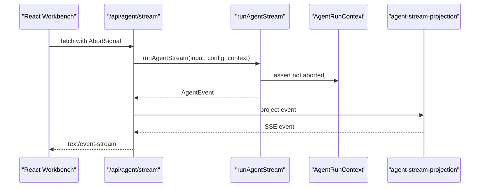

# 05. Streaming, Cancellation, And Events

This chapter explains how an agent run moves from a one-shot JSON response to a
live process. Streaming, cancellation, and runtime events are the foundation of
a real agent experience.

After reading this chapter, you should understand:

- how a streaming route differs from a normal JSON route
- why `AbortSignal` crosses runtime boundaries
- why agent events and frontend events are separate
- how projection turns internal events into UI-facing events

## Background

A synchronous agent endpoint is hard to use. Real agent work takes time and has
observable phases:

- prompt built
- model started
- assistant text streaming
- tool requested
- tool started
- tool finished
- run succeeded or failed

An agent run needs to expose progress while it is happening.

## Streaming Route

The project added:

```text
app/api/agent/stream/route.ts
```

The route returns Server-Sent Events. It is still a route boundary, not the
agent runtime.

The backend emits internal `AgentEvent`s. The route projects them to frontend
SSE events.

## Cancellation Boundary

Cancellation was designed as a real abort chain, not a prompt instruction:

```text
React AbortController
  -> fetch signal
  -> NextRequest.signal
  -> AgentRunContext.signal
  -> OpenAI SDK request option
  -> stream chunk guard
  -> tool runtime checks
```

The key file is:

```text
lib/agent-run-context.ts
```

The runtime calls `assertAgentRunNotAborted(...)` at important checkpoints.

## Agent Events

`lib/agent-events.ts` introduced the internal event model.

Examples:

```text
run_started
model_started
assistant_delta
tool_requested
tool_started
tool_finished
step_created
run_succeeded
run_failed
```

Later phases added:

```text
model_requested
model_completed
tool_permission_decided
approval_requested
```

## Projection Boundary

`lib/agent-stream-projection.ts` maps internal events to frontend events.

This keeps the browser from becoming the runtime. The frontend observes; the
server owns model calls and tools.

## Data Flow



## Git Evidence

Relevant commits:

```text
d5f8ad8 Stream agent progress and answer
edf8405 Add cancellable agent runtime boundaries
72bed76 Add agent harness event state
6fb0b86 Project agent events to stream responses
```

## Tradeoff

Streaming introduced more event names, but it preserved a clean direction:

```text
runtime event -> projection -> frontend event
```

That decision made the later Debug Console possible.

## Common Misunderstandings

### Misunderstanding 1: Streaming Only Splits The Final Answer Into Chunks

Agent streaming includes more than answer chunks. It includes process text,
tool starts, tool finishes, errors, cancellation, and final commits.

### Misunderstanding 2: Cancellation Only Stops The Frontend

Cancellation must reach the runtime. Otherwise the UI can stop rendering while
the backend continues calling models or running tools.

### Misunderstanding 3: Internal Events Can Go Directly To The UI

Internal events often contain runtime details. A projection layer stabilizes the
frontend protocol and preserves richer internal semantics for future telemetry.

## Chapter Summary

This chapter turns an agent run into a live process: the frontend receives
events, the runtime reacts to abort, and internal events are projected into a
frontend protocol.

## Chapter Checkpoint

Verify two things: validation failure never opens the SSE stream, and terminal
run events are locked down by deterministic tests.

1. POST an empty body to `/api/agent/stream` (no key required). Measured: the
   response is a plain JSON 400 (`content-type: application/json`), not an SSE
   error event — validation completes before the stream opens:

```bash
curl -s -i -X POST http://localhost:3000/api/agent/stream \
  -H 'Content-Type: application/json' -d '{}'
```

```text
HTTP/1.1 400 Bad Request
content-type: application/json

{"ok":false,"error":"Request body validation failed.","validationErrors":{"formErrors":[],"fieldErrors":{"task":["Field `task` is required."]}}}
```

2. Terminal-event tests (no key, fake gateway):

```bash
npx tsx --test tests/agent-run-terminal-events.test.ts
```

```text
✔ an aborted run emits run_cancelled as its terminal event
✔ a failed run emits run_failed as its terminal event
ℹ pass 2
```
