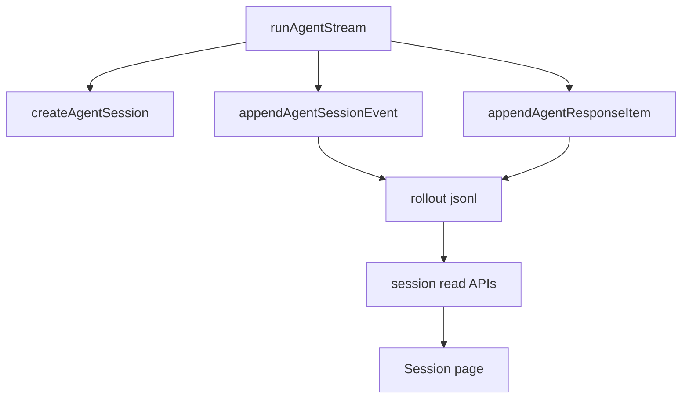

# 07. JSONL Sessions And Usage

This chapter explains why agent runs need durable records and why usage needs
both raw provider data and normalized totals.

After reading this chapter, you should understand:

- how JSONL sessions differ from the frontend Debug Console
- why the session store appends records
- why raw usage and normalized usage are both preserved
- why cached token counts use `null` for unknown instead of fake zeroes

## Background

Logs are useful while a process is running, but they are not enough for an agent
harness. A run should leave behind an inspectable record.

The project added a small Codex-style session store.

## Session Store

The key file is:

```text
lib/agent-session-store.ts
```

Session files live under:

```text
data/agent-sessions/YYYY/MM/DD/rollout-{timestamp}-{runId}.jsonl
```

Each line is a tagged JSON record.

Current row kinds include:

```text
session_meta
turn_context
agent_event
response_item
```

`response_item` arrived after the model-visible history was introduced.

## Session Read APIs

The project added:

```text
GET /api/agent/sessions
GET /api/agent/sessions/[id]
```

These are read-only inspection APIs. They are not resume yet.

## Usage Tracking

Usage moved into:

```text
lib/agent-usage.ts
```

The runtime keeps:

- raw provider usage
- normalized token usage
- per-call usage
- accumulated run usage
- final call usage

This distinction matters because one run may contain many model calls.

## Cached Tokens

Cached token fields are nullable by design.

```text
0     provider reported zero cached tokens
null  provider did not report the field
```

This was a concrete design decision after seeing raw usage fields in provider
responses. Unknown should not be silently converted to zero.

## Data Flow



## Git Evidence

Relevant commits:

```text
7544963 Persist agent stream sessions as JSONL
837f89f Add provider dialect architecture
fa3fe71 Clarify agent token usage summing
```

## Tradeoff

The JSONL store is deliberately append-only and plain. That makes it easy to
inspect before it becomes a real replay engine.

## Common Misunderstandings

### Misunderstanding 1: Debug Console And JSONL Are The Same Log

Debug Console is for live development inspection. JSONL sessions are durable
records for replay, resume, and export. They can show the same facts, but they
should not be the same data source.

### Misunderstanding 2: Missing Usage Fields Should Be Zero

Zero means the provider reported zero. `null` means unknown or not normalized.
Those are different, especially for cached tokens.

### Misunderstanding 3: JSONL Is Only For Debugging

JSONL also prepares session listing, replay, resume, and telemetry export. It
is a run record, not only log output.

## Chapter Summary

This chapter establishes durable run records: events append to JSONL, usage is
stored in raw and normalized forms, sessions can be read by the frontend, and
Debug and Session semantics stay separate.

## Chapter Checkpoint

Verify the session read API and the JSONL layout on disk.

1. The real empty response when no sessions exist (just start the dev server;
   no key required):

```bash
curl -s http://localhost:3000/api/agent/sessions
```

Measured output:

```json
{"ok":true,"sessions":[]}
```

Note that it is still the discriminated `ok/sessions` shape, not a bare array —
an empty list goes through the same contract.

2. Requires `.env.local` configured per chapter 0: after one agent run, inspect
   the disk:

```bash
find data/agent-sessions -name '*.jsonl'
```

Expect `data/agent-sessions/YYYY/MM/DD/rollout-{timestamp}-{runId}.jsonl`. With
`head -3`, each line is tagged JSON: the first two rows have `type`
`session_meta` and `turn_context`, followed by `agent_event` and
`response_item` rows. `GET /api/agent/sessions` then returns a non-empty list.
