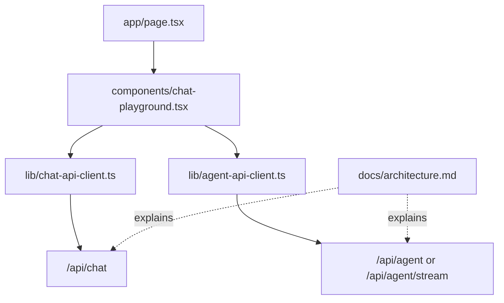

# 03. Living Architecture 与 Workbench

本章说明为什么项目需要“会更新的架构图”和一个可以操作的前端 workbench。Agent runtime 不是只靠阅读源码就容易理解的系统，它需要持续可见的地图和可运行的观察入口。

读完本章后，应该理解：

- `docs/architecture.md` 为什么是 living document
- 前端 workbench 在学习型 agent 项目里的职责
- 为什么 UI 先服务于检查 backend，而不是先追求产品化
- 文档、前端和 backend 之间的数据流关系

## 背景

项目逐步长成 agent 后，结构会越来越难记。README 里的简单列表不足以解释模块边界、数据流和设计取舍。

项目需要两个学习 surface：

1. 代码的 living architecture map
2. 能尝试 route 的 frontend workbench

## Living Architecture

`docs/architecture.md` 成为项目地图。

它不是宣传文档，而是记录：

- current goal
- runtime flow
- layer map
- route boundaries
- frontend/backend contract
- model gateway
- tool runtime
- session store
- future work

维护规则很简单：

```text
如果 route、contract、service responsibility 或 agent/tool boundary 变化，
同一次变更就更新 docs/architecture.md。
```

Agent runtime 有很多小文件。如果没有地图，小文件架构会变成迷宫。

## Workbench UI

前端从简单页面演化成 workbench。

它的角色还不是 polished product UI，而是学习和检查 surface。

核心文件：

```text
components/chat-playground.tsx
```

它先后加入：

- Chat mode
- Agent mode
- streaming output
- Debug page
- Session page
- assistant text Markdown rendering
- collapsible tool batches

## 为什么这里需要前端

在这个阶段，前端不承担 agent runtime 的核心逻辑。它主要是 inspection surface：让 backend 的输入、输出、步骤和状态能够被看见。

有用的 React 概念是：

- typed state
- reducer-style state transition
- request/response flow
- rendering discriminated unions

前端不是 agent。它观察后端 agent。

## 数据流



## 设计选择

Workbench 可以知道 API response shape，但不能：

- 读取 server env vars
- 创建 OpenAI clients
- 执行 tools
- 决定 permissions
- 解析 provider wire protocols

这些属于后端 harness。

## Git 证据

相关早期提交：

```text
365c19d Redesign model workbench UI
```

以及记忆中围绕 `docs/architecture.md` 的 living architecture 工作。

代码和文档一起演化。这现在是项目规则。

## 本章教什么

Agent 学习项目从第一天起就需要 introspection。

如果看不到数据流，下一个功能就会像魔法。Architecture map 和 workbench 防止这一点。

## 常见误解

### 误解一：文档是最后补的

在这个项目里，架构文档是 runtime 的一部分。边界变化时同步更新文档，可以防止小文件架构变成不可导航的碎片。

### 误解二：Workbench 是正式产品界面

Workbench 首先是检查界面。它暴露 request、response、stream、debug、session 等信息，帮助判断 backend 是否真的按预期运行。

### 误解三：前端越少越好

后端 agent 如果没有可视化入口，很多问题只能看日志猜。Workbench 的价值在于把运行时状态变成可交互的反馈。

## 本章小结

Living architecture 负责解释系统结构，workbench 负责观察系统行为。两者让项目在快速演化时仍然可理解。
