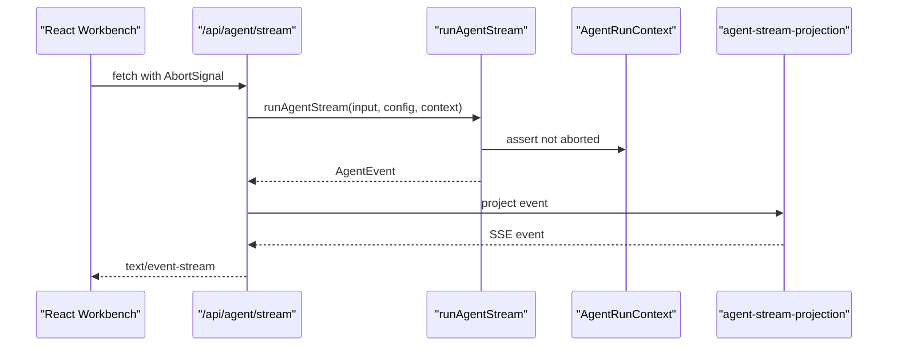

# 05. Streaming、取消与 Events

本章说明 agent run 如何从“一次性返回结果”变成“运行中持续输出”。流式输出、取消和事件模型是后续真实 agent 体验的基础。

读完本章后，应该理解：

- streaming route 与普通 JSON route 的区别
- `AbortSignal` 为什么要传过 runtime 边界
- agent event 与前端事件为什么要分开
- projection boundary 如何把内部事件转换成 UI 可消费事件

## 背景

同步 agent endpoint 很难使用。真实 agent 工作会持续一段时间，并有可观察阶段：

- prompt built
- model started
- assistant text streaming
- tool requested
- tool started
- tool finished
- run succeeded or failed

Agent run 需要在执行过程中持续暴露进度。

## Streaming Route

项目加入：

```text
app/api/agent/stream/route.ts
```

这个 route 返回 Server-Sent Events。它仍然是 route boundary，不是 agent runtime。

后端发出内部 `AgentEvent`，route 把它投影成 frontend SSE events。

## 取消边界

取消被设计成真实 abort chain，而不是发给模型的一句 prompt instruction：

```text
React AbortController
  -> fetch signal
  -> NextRequest.signal
  -> AgentRunContext.signal
  -> OpenAI SDK request option
  -> stream chunk guard
  -> tool runtime checks
```

关键文件：

```text
lib/agent-run-context.ts
```

Runtime 会在关键 checkpoint 调用 `assertAgentRunNotAborted(...)`。

## Agent Events

`lib/agent-events.ts` 引入内部 event model。

例子：

```text
run_started
model_started
assistant_delta
tool_requested
tool_started
tool_finished
step_created
run_succeeded
run_failed
```

后续阶段又加入：

```text
model_requested
model_completed
tool_permission_decided
approval_requested
```

## Projection Boundary

`lib/agent-stream-projection.ts` 把内部 events 映射成 frontend events。

这让浏览器不会变成 runtime。前端观察；服务端拥有模型调用和工具执行。

## 数据流



## Git 证据

相关提交：

```text
d5f8ad8 Stream agent progress and answer
edf8405 Add cancellable agent runtime boundaries
72bed76 Add agent harness event state
6fb0b86 Project agent events to stream responses
```

## 取舍

Streaming 带来更多 event names，但保留了清晰方向：

```text
runtime event -> projection -> frontend event
```

这个决定让后来的 Debug Console 成为可能。

## 常见误解

### 误解一：流式就是把最终答案拆成小块

Agent 流式不只是答案分块。它还包括模型过程文本、工具开始、工具结束、错误、取消和最终提交等事件。

### 误解二：取消只需要前端停止显示

取消必须进入 runtime。否则前端虽然不显示了，后端仍可能继续调用模型或执行工具。

### 误解三：内部事件可以直接给 UI

内部事件通常包含 runtime 细节。投影层可以稳定前端协议，也为未来 telemetry 保留更完整的内部语义。

## 本章小结

这一章把 agent run 变成 live process：前端可以持续接收事件，runtime 可以响应取消，内部事件通过 projection boundary 转换成前端协议。

## 本章验证点

验证两件事：校验失败不会打开 SSE 流；run 的终态事件有确定性测试兜底。

1. 空 body 打 `/api/agent/stream`（无需 key）。实测返回的是普通 JSON 400（`content-type: application/json`），不是 SSE error event——validation 在流打开之前就完成了：

```bash
curl -s -i -X POST http://localhost:3000/api/agent/stream \
  -H 'Content-Type: application/json' -d '{}'
```

```text
HTTP/1.1 400 Bad Request
content-type: application/json

{"ok":false,"error":"Request body validation failed.","validationErrors":{"formErrors":[],"fieldErrors":{"task":["Field `task` is required."]}}}
```

2. 终态事件测试（无需 key，fake gateway）：

```bash
npx tsx --test tests/agent-run-terminal-events.test.ts
```

```text
✔ an aborted run emits run_cancelled as its terminal event
✔ a failed run emits run_failed as its terminal event
ℹ pass 2
```
