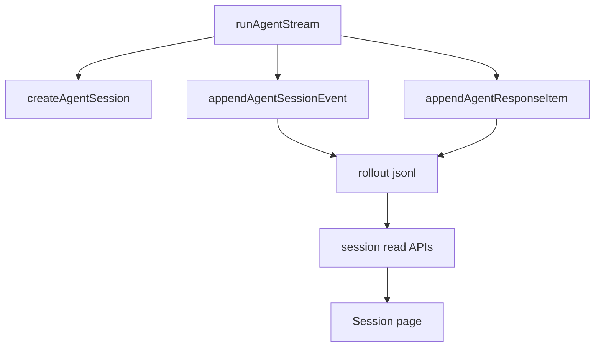

# 07. JSONL Sessions 与 Usage

本章说明为什么 agent run 需要持久化，以及为什么 usage 要同时保存原始 provider 数据和规范化统计。

读完本章后，应该理解：

- JSONL session 与前端 Debug Console 的目标不同
- session store 为什么按事件追加写入
- raw usage 与 normalized usage 为什么都要保留
- cache token 应该用 `null` 表示未知，而不是伪造 0

## 背景

Logs 在进程运行时有用，但对 agent harness 不够。一次 run 应该留下可检查记录。

项目加入了一个小型 Codex-style session store。

## Session Store

关键文件：

```text
lib/agent-session-store.ts
```

Session files 位于：

```text
data/agent-sessions/YYYY/MM/DD/rollout-{timestamp}-{runId}.jsonl
```

每一行都是 tagged JSON record。

当前 row kinds 包括：

```text
session_meta
turn_context
agent_event
response_item
```

`response_item` 是 model-visible history 出现后加入的。

## Session Read APIs

项目加入：

```text
GET /api/agent/sessions
GET /api/agent/sessions/[id]
```

这些是只读 inspection APIs，还不是 resume。

## Usage Tracking

Usage 移到：

```text
lib/agent-usage.ts
```

Runtime 保留：

- raw provider usage
- normalized token usage
- per-call usage
- accumulated run usage
- final call usage

这个区分很重要，因为一次 run 可能包含多次 model call。

## Cached Tokens

Cached token fields 设计为 nullable。

```text
0     provider 明确报告 cached tokens 为 0
null  provider 没有报告该字段
```

这是看到 provider raw usage 后做出的具体设计决定。Unknown 不应该被静默转换为 zero。

## 数据流



## Git 证据

相关提交：

```text
7544963 Persist agent stream sessions as JSONL
837f89f Add provider dialect architecture
fa3fe71 Clarify agent token usage summing
```

## 取舍

JSONL store 故意保持 append-only 和 plain。这样它在成为真正 replay engine 前就已经容易检查。

## 常见误解

### 误解一：Debug Console 和 JSONL 是同一种日志

Debug Console 面向开发时观察，JSONL session 面向持久化、回放和 resume。它们可以展示相同事实，但不能混成同一个数据源。

### 误解二：usage 字段缺失时应该填 0

0 表示确定为零，`null` 表示 provider 没给或无法归一化。两者语义不同，尤其是 cached tokens。

### 误解三：JSONL 只用于调试

JSONL 未来还会支撑 session list、session replay、resume 和 telemetry export。它是运行记录，不只是日志输出。

## 本章小结

这一章建立了持久化运行记录：事件按 JSONL 追加写入，usage 同时保留 raw 和 normalized 形态，前端可以读取 session，但 Debug 与 Session 的语义保持分离。

## 本章验证点

验证 session 读取 API 与 JSONL 落盘结构。

1. 无 session 时的真实空响应（启动 dev server 即可，无需 key）：

```bash
curl -s http://localhost:3000/api/agent/sessions
```

实测输出：

```json
{"ok":true,"sessions":[]}
```

注意它仍然是 `ok/sessions` 的 discriminated shape，而不是裸数组——空列表也走同一契约。

2. 需要先按第 0 章配好 `.env.local`：跑一次 agent run 之后检查落盘：

```bash
find data/agent-sessions -name '*.jsonl'
```

预期出现 `data/agent-sessions/YYYY/MM/DD/rollout-{timestamp}-{runId}.jsonl`。用 `head -3` 查看该文件：每行是 tagged JSON，前两行 `type` 依次为 `session_meta`、`turn_context`，随后是 `agent_event` 与 `response_item` 行。此时再请求 `GET /api/agent/sessions`，`sessions` 数组不再为空。
